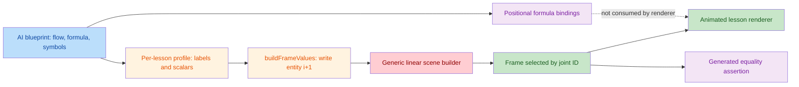

# AI Step Animation Review (10072-10134)

> **Resolution update (2026-08-31): CLOSED.** This report preserves the independent pre-fix findings. The current implementation replaces positional chains with authored operands, targets, routes and equations; renders semantic formula bindings and source-to-target motion; preserves pre-operation values; and adds arithmetic regression tests for the cited examples plus later RoPE, LayerNorm, pointwise-convolution, cross-entropy and RNN-input issues. All 63 lessons and 310 joints pass the final contract, semantic, KaTeX and three-viewport browser sweep. See [the final review](guided-step-animation-final-review.md).

## Intent

Intent: verify that all 63 AI lessons turn each approved blueprint flow joint into a numerically correct, beginner-readable, visibly changing, formula-bound, and diagnostically useful scene. The current implementation is structurally complete, but it does not meet that semantic acceptance bar.

## Findings

| No. | Severity | Issue | Required correction | New-file evidence |
| ---: | --- | --- | --- | --- |
| 1 | BLOCKER | All 63 AI lessons are forced through one ordinal, single-source/single-target chain. | Let profiles or lesson-specific builders declare semantic entities, topology, operands, targets, and transfers; model branches and multi-input operations explicitly. | [profile.ts:48](/Users/bytedance/MyProject/algo-vis/src/config/lessonScenes/ai/profile.ts:48), [progressiveLessonScene.ts:164](/Users/bytedance/MyProject/algo-vis/src/config/sceneBuilders/progressiveLessonScene.ts:164), [progressiveLessonScene.ts:172](/Users/bytedance/MyProject/algo-vis/src/config/sceneBuilders/progressiveLessonScene.ts:172), [progressiveLessonScene.ts:191](/Users/bytedance/MyProject/algo-vis/src/config/sceneBuilders/progressiveLessonScene.ts:191) |
| 2 | MAJOR | Formula bindings are position-based, semantically wrong, and never rendered. | Declare bindings by semantic entity ID and render the binding in formula/symbol phases. | [progressiveLessonScene.ts:217](/Users/bytedance/MyProject/algo-vis/src/config/sceneBuilders/progressiveLessonScene.ts:217), [cnn.ts:7](/Users/bytedance/MyProject/algo-vis/src/config/lessonScenes/ai/cnn.ts:7), [GuidedLessonVisualizer.tsx:127](/Users/bytedance/MyProject/algo-vis/src/components/visualizers/GuidedLessonVisualizer.tsx:127) |
| 3 | MAJOR | Every debug assertion is generated from the value it checks, so debug mode cannot detect a bad computation. | Store independent invariants and expected values per lesson/frame, then show observed value, expected value, and pass/fail. | [progressiveLessonScene.ts:202](/Users/bytedance/MyProject/algo-vis/src/config/sceneBuilders/progressiveLessonScene.ts:202), [progressiveLessonScene.ts:206](/Users/bytedance/MyProject/algo-vis/src/config/sceneBuilders/progressiveLessonScene.ts:206), [AnimatedLessonScene.tsx:353](/Users/bytedance/MyProject/algo-vis/src/components/visualizers/AnimatedLessonScene.tsx:353) |
| 4 | MAJOR | Several shipped values contradict their labels, explanations, or formulas. | Correct the affected profiles and include enough operands/units for the displayed result to be recomputed. | [transformer.ts:117](/Users/bytedance/MyProject/algo-vis/src/config/lessonScenes/ai/transformer.ts:117), [transformer.ts:151](/Users/bytedance/MyProject/algo-vis/src/config/lessonScenes/ai/transformer.ts:151), [diffusion.ts:18](/Users/bytedance/MyProject/algo-vis/src/config/lessonScenes/ai/diffusion.ts:18), [diffusion.ts:31](/Users/bytedance/MyProject/algo-vis/src/config/lessonScenes/ai/diffusion.ts:31) |
| 5 | MAJOR | Ten adjacent joint pairs do not change any entity value in the scene canvas. | Eliminate no-op writes and test rendered canvas semantics independently of the detached transfer summary. | [cnn.ts:55](/Users/bytedance/MyProject/algo-vis/src/config/lessonScenes/ai/cnn.ts:55), [rnn.ts:19](/Users/bytedance/MyProject/algo-vis/src/config/lessonScenes/ai/rnn.ts:19), [transformer.ts:57](/Users/bytedance/MyProject/algo-vis/src/config/lessonScenes/ai/transformer.ts:57), [diffusion.ts:19](/Users/bytedance/MyProject/algo-vis/src/config/lessonScenes/ai/diffusion.ts:19) |

### 1. Generic chains replace the actual computation

`buildFrameValues` changes exactly one slot per joint, and `createProgressiveLessonScene` always connects adjacent array positions and emits one transfer from entity `i` to entity `i+1`. The AI profile schema has no way to specify operands, branching, graph adjacency, attention links, masks, distributions, or per-frame visibility/position. The audit reconstructed all 310 AI frames: every frame has exactly one source, one target, and one transfer; none has an operation expression.

This creates false causal explanations. In 10078, the labels describe `F(X)` and `P(X)`, but the generated shortcut frame transfers the residual into the projection and the addition frame transfers only `P(X)` into the output; the two addends are never jointly visible as operands ([cnn.ts:96](/Users/bytedance/MyProject/algo-vis/src/config/lessonScenes/ai/cnn.ts:96), [cnn.ts:103](/Users/bytedance/MyProject/algo-vis/src/config/lessonScenes/ai/cnn.ts:103)). In 10102, a `graph` scene consists of metric/stage labels such as degrees, one normalized edge, and an aggregator, then the shared builder connects those labels as a linear chain instead of depicting nodes, self-loops, normalized neighbor messages, and aggregation ([gnn.ts:6](/Users/bytedance/MyProject/algo-vis/src/config/lessonScenes/ai/gnn.ts:6)). The same reduction affects CNN windows, RNN recurrence, Q/K/V attention, diffusion trajectories, GAN branches, and VAE latent operations.

Transfers are not drawn between the corresponding canvas entities. The scene renderers display cards/bars, while the motion appears later in a separate summary strip ([AnimatedLessonScene.tsx:318](/Users/bytedance/MyProject/algo-vis/src/components/visualizers/AnimatedLessonScene.tsx:318), [AnimatedLessonScene.tsx:323](/Users/bytedance/MyProject/algo-vis/src/components/visualizers/AnimatedLessonScene.tsx:323)). This fails the approved requirement that semantic movement be projected onto the relevant entities rather than beside the scene.

### 2. Formula binding is neither correct nor visible

Bindings are assigned by symbol index modulo entity count. For 10072, the blueprint symbols begin `X`, `W`, `Y`, and strides, while the scene entity order begins input, padded boundary, window, and accumulator. Consequently `W` binds to "padded boundary", `Y` binds to "3x3 input window", and the stride symbols bind to the accumulator rather than their labeled stride entities ([aiLessonBlueprints/cnn.ts:12](/Users/bytedance/MyProject/algo-vis/src/config/aiLessonBlueprints/cnn.ts:12), [lessonScenes/ai/cnn.ts:7](/Users/bytedance/MyProject/algo-vis/src/config/lessonScenes/ai/cnn.ts:7)). Similar mismatches occur whenever symbol order differs from stage-label order or the symbol count wraps around the entity list, including 10134.

The runtime renders the formula as an independent KaTeX block and has no read of `spec.formulaBindings`. Thus even a correct binding would not produce the formula overlay required by the design. Existing validation checks only symbol-set equality and entity existence, so it cannot detect either failure.

### 3. Debug checks are tautologies

For every frame, the builder reads `targetValue` from the generated snapshot, writes that same value into `entityStates[targetId]`, and uses the same variable as the assertion's expected value. The debug UI then prints only "check target: expected value". This can never expose a wrong formula, missing operand, probability-sum error, shape mismatch, or bad intermediate result produced by the same profile.

The audit found this pattern in 310/310 AI frames. Examples that should instead have independent checks include `sum(products)+bias == Y(0,0)` for 10072, neighborhood weights summing to one for 10105, `0.4 + 0.6 * 0.25 == 0.55` for 10127, and posterior/prior statistics plus rollout divergence for 10134 ([vae.ts:10](/Users/bytedance/MyProject/algo-vis/src/config/lessonScenes/ai/vae.ts:10), [vae.ts:103](/Users/bytedance/MyProject/algo-vis/src/config/lessonScenes/ai/vae.ts:103)).

### 4. Concrete numeric and label contradictions

- **10099:** labels are ordered as optimizer step, smoothed probability, accumulated gradient, learning rate, while `stepValues` are `0.9, 0.25, 1, 0.0004`. The generated third frame therefore shows `warmup learning rate = 1` while its explanation says the optimizer step became 1; the fourth shows `optimizer update count = 0.0004` while its explanation says the learning rate became 0.0004 ([transformer.ts:117](/Users/bytedance/MyProject/algo-vis/src/config/lessonScenes/ai/transformer.ts:117), [transformer.ts:119](/Users/bytedance/MyProject/algo-vis/src/config/lessonScenes/ai/transformer.ts:119), [transformer.ts:123](/Users/bytedance/MyProject/algo-vis/src/config/lessonScenes/ai/transformer.ts:123)).
- **10101:** the scene states `C=100`, `N=12`, and `D=80`, but the lesson formula is `C approximately 6ND`; these values imply `C=5760`, not 100. In addition, the first four generated outputs are one explanation ahead because the budget frame writes `N=12`, the `N` frame writes `D=80`, and so on ([lessonScenes/ai/transformer.ts:148](/Users/bytedance/MyProject/algo-vis/src/config/lessonScenes/ai/transformer.ts:148), [lessonScenes/ai/transformer.ts:151](/Users/bytedance/MyProject/algo-vis/src/config/lessonScenes/ai/transformer.ts:151), [aiLessonBlueprints/transformer.ts:259](/Users/bytedance/MyProject/algo-vis/src/config/aiLessonBlueprints/transformer.ts:259)).
- **10112:** the second result writes `0.73` into "cumulative signal alpha-bar", but its explanation defines `0.73` as denoising consistency after training/adaptation. These are different quantities ([diffusion.ts:18](/Users/bytedance/MyProject/algo-vis/src/config/lessonScenes/ai/diffusion.ts:18), [diffusion.ts:20](/Users/bytedance/MyProject/algo-vis/src/config/lessonScenes/ai/diffusion.ts:20), [diffusion.ts:23](/Users/bytedance/MyProject/algo-vis/src/config/lessonScenes/ai/diffusion.ts:23)).
- **10113:** an entity labeled "sampler branch count" receives `0.8`, while the explanation says there are four DDIM/DPM++/Heun/Euler branches and reinterprets `0.8` as a normalized coverage score. A count must display 4, or the entity must be relabeled as a clearly defined score ([diffusion.ts:31](/Users/bytedance/MyProject/algo-vis/src/config/lessonScenes/ai/diffusion.ts:31), [diffusion.ts:33](/Users/bytedance/MyProject/algo-vis/src/config/lessonScenes/ai/diffusion.ts:33), [diffusion.ts:36](/Users/bytedance/MyProject/algo-vis/src/config/lessonScenes/ai/diffusion.ts:36)).

### 5. Some joints change only decoration outside the canvas

The following adjacent pairs have identical complete entity-value maps. Their changing transfer endpoint and progressively revealed connection make `semanticSceneSignature` differ, but matrix/sequence/distribution canvases do not render those connections or transfers. Inside the scene canvas, only active/completed styling changes, which the design explicitly excludes as a semantic state change.

| ID | Adjacent joints with identical values | Profile evidence |
| ---: | --- | --- |
| 10075 | expand input positions -> scatter kernel contributions | [cnn.ts:55](/Users/bytedance/MyProject/algo-vis/src/config/lessonScenes/ai/cnn.ts:55) |
| 10078 | compute residual -> match shortcut shape | [cnn.ts:100](/Users/bytedance/MyProject/algo-vis/src/config/lessonScenes/ai/cnn.ts:100) |
| 10080 | temporal multiply-add -> generate all positions | [cnn.ts:130](/Users/bytedance/MyProject/algo-vis/src/config/lessonScenes/ai/cnn.ts:130) |
| 10081 | initialize receptive field -> read layer parameters | [cnn.ts:146](/Users/bytedance/MyProject/algo-vis/src/config/lessonScenes/ai/cnn.ts:146) |
| 10083 | initialize hidden state -> read input by time | [rnn.ts:19](/Users/bytedance/MyProject/algo-vis/src/config/lessonScenes/ai/rnn.ts:19) |
| 10088 | encode source -> pass final context | [rnn.ts:80](/Users/bytedance/MyProject/algo-vis/src/config/lessonScenes/ai/rnn.ts:80) |
| 10095 | enter position-wise linear layer -> expand to `d_ff` | [transformer.ts:57](/Users/bytedance/MyProject/algo-vis/src/config/lessonScenes/ai/transformer.ts:57) |
| 10098 | create target query -> create source key/value | [transformer.ts:104](/Users/bytedance/MyProject/algo-vis/src/config/lessonScenes/ai/transformer.ts:104) |
| 10100 | apply penalties/normalization -> retain top beams | [transformer.ts:133](/Users/bytedance/MyProject/algo-vis/src/config/lessonScenes/ai/transformer.ts:133) |
| 10112 | train/adapt for schedule -> equalize training budget | [diffusion.ts:19](/Users/bytedance/MyProject/algo-vis/src/config/lessonScenes/ai/diffusion.ts:19) |

## Coverage And Check Evidence

| Family | IDs reviewed | Lessons | Frames |
| --- | --- | ---: | ---: |
| CNN | 10072-10081 | 10 | 42 |
| RNN | 10082-10091 | 10 | 43 |
| Transformer | 10092-10101 | 10 | 50 |
| GNN | 10102-10110 | 9 | 54 |
| Diffusion | 10111-10118 | 8 | 40 |
| GAN | 10119-10126 | 8 | 39 |
| VAE | 10127-10134 | 8 | 42 |
| **Total** | **10072-10134** | **63** | **310** |

Read-only checks run against the current worktree:

- Focused Node tests: `tests/lessonSceneTypes.test.ts`, `tests/guidedLessonScenes.contract.test.ts`, and `tests/fullCourseBlueprints.test.ts`: **12/12 passed**.
- TypeScript: `pnpm exec tsc --noEmit --incremental false`: **passed**.
- Focused ESLint over the AI scenes, scene protocol/builder, and AI render path: **passed with zero warnings**.
- Whitespace check over tracked reviewed diffs: `git diff --check`: **passed**; new AI scene files were checked separately with `git diff --no-index --check` and produced no whitespace diagnostics.
- Custom full-AI contract audit: **63 scenes, 310 frames, 247/247 adjacent semantic signatures changed, 0 protocol validation errors, 280 declared bindings**.
- Custom semantic-shape audit: **310/310 frames use one source, one target, and one transfer; 310/310 assertions compare against their own target value; 0/310 operations provide an expression; 10 adjacent pairs have unchanged entity values**.

The passing tests establish registration, protocol shape, KaTeX parseability, and signature differences. They do not invalidate the findings above because they do not evaluate semantic topology, binding meaning, independent arithmetic, or whether a transfer is animated between its canvas entities.

Browser/E2E checks were not run because the review was restricted to read-only checks and the configured Playwright workflow writes reports, traces, and screenshots. Residual UI risks such as mobile overlap and frame-height stability therefore remain outside this review's direct evidence.
