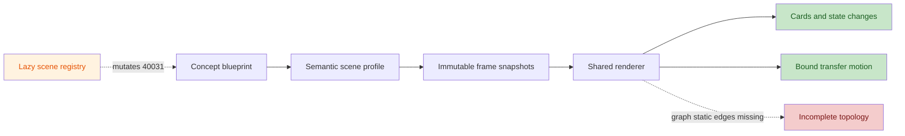

# Concepts Step-Animation Final Review (40001-40036)

> **Resolution update (2026-08-31): CLOSED.** This report preserves the second independent pre-fix review. Focused tests now cover the cited graph topology, parser completion, register-allocation spill rewrite, import-order safety and 32-bit instruction encoding, cache policy, page-fault retry, formula bindings and causal reveal timing. All 36 lessons and 164 joints pass contract, semantic and three-viewport browser coverage. See [the final review](guided-step-animation-final-review.md).

## Findings

Verdict: **FAIL**. The replacement scene model is a substantial improvement and all 36 lessons now have semantic snapshots, explicit bindings, and source-to-target transfer animation. Two release blockers, five major lesson defects, and four moderate issues remain.

### Blocker

| ID | Finding | Evidence | Required correction |
|---|---|---|---|
| B1 | **Graph lessons do not render their complete topology.** `GraphScene` lays cards out in a grid but draws no edges and ignores `spec.layout.positions`. The shared overlay finds all visible connections, then deliberately clears non-transfer connection geometry for graph scenes. Consequently only an edge carrying a transfer in the current frame is drawn. For example, 40002's final state declares `10 -> 20`, `20 -> 25`, and `25 -> 30`, but only the latter two have transfers, so the retained `10 -> 20` link disappears. This blocks the “real visible topology” requirement for graph lessons 40002, 40004, 40005, 40014, 40017, 40019, 40020, 40022, and 40023. | [AnimatedLessonScene.tsx:125](../../src/components/visualizers/AnimatedLessonScene.tsx#L125), [AnimatedLessonScene.tsx:346](../../src/components/visualizers/AnimatedLessonScene.tsx#L346), [AnimatedLessonScene.tsx:365](../../src/components/visualizers/AnimatedLessonScene.tsx#L365), [dataStructuresAlgorithms.ts:143](../../src/config/lessonScenes/concepts/dataStructuresAlgorithms.ts#L143) | Draw every `visibleConnectionId` in graph scenes and use stable graph coordinates; layer transfer motion over, rather than instead of, persistent edges. |
| B2 | **40031 has two formulas whose value depends on module load order.** The canonical blueprint still describes an `addi` word with `rs2` and no `funct3`. Importing the scene registry mutates that shared blueprint object to the correct I-type fields. The page reads and renders the blueprint before its visualizer's lazy import, so a cold visit can retain the old sidebar formula while the loaded guided scene uses the mutated one; later navigation can show different content. The semantic test statically imports the registry, so the mutation occurs before its assertion and masks the bad source data. | [computerArchitecture blueprint.ts:19](../../src/config/conceptLessonBlueprints/computerArchitecture.ts#L19), [concept scene index.ts:27](../../src/config/lessonScenes/concepts/index.ts#L27), [ConceptDetailPage.tsx:14](../../src/pages/ConceptDetailPage.tsx#L14), [ConceptDetailPage.tsx:55](../../src/pages/ConceptDetailPage.tsx#L55), [ConceptDetailPage.tsx:181](../../src/pages/ConceptDetailPage.tsx#L181), [concepts/index.ts:11](../../src/concepts/index.ts#L11), [conceptLessonSceneSemantics.test.ts:206](../../tests/conceptLessonSceneSemantics.test.ts#L206) | Fix the blueprint at its declaration and remove all mutation from scene construction. Add an import-order regression test. |

### Major

| ID | Finding | Evidence | Required correction |
|---|---|---|---|
| M1 | **40034 does not map its flow joints to their stated branches.** Joint 2 says “TLB hit and permission allowed,” but its frame produces a TLB miss. Joint 5 says “permission denied: raise protection fault and stop,” but its frame produces `allowed` and continues. The state is now internally continuous, but two directly addressable buttons teach the opposite of their labels. | [computerArchitecture blueprint.ts:154](../../src/config/conceptLessonBlueprints/computerArchitecture.ts#L154), [computerArchitecture scene.ts:113](../../src/config/lessonScenes/concepts/computerArchitecture.ts#L113) | Make the flow one continuous worked trace, or represent hit/fault/protection alternatives as explicit branches whose labels and states agree. |
| M2 | **40030's register-allocation example contains impossible data.** `V` contains only `v1`, `v2`, and `v3`, while the interference graph contains `v2-v4`. Spill rewriting then drops the original `SUB v3`: the visible rewritten list has four instructions but the final state claims five. The assertions validate these authored contradictions instead of detecting them. | [compiler scene.ts:142](../../src/config/lessonScenes/concepts/compiler.ts#L142), [compiler scene.ts:152](../../src/config/lessonScenes/concepts/compiler.ts#L152), [compiler scene.ts:154](../../src/config/lessonScenes/concepts/compiler.ts#L154), [compiler scene.ts:155](../../src/config/lessonScenes/concepts/compiler.ts#L155) | Use one closed virtual-register set, preserve every selected instruction through rewriting, and derive the displayed machine count from the rewritten sequence. |
| M3 | **40026 still is not a truthful LL(1) trace.** The third joint promises the `T' -> epsilon` and `E' -> +TE'` transitions, but the frame retains the previous stack and production. The fourth frame consumes four tokens at once while leaving the stack unchanged; the accepted final frame still shows lookahead `+` and production `T'->*FT'`, not EOF and the two epsilon reductions. Current tests check only empty input, final stack, counts, and `accepted`, so the contradictory parser state passes. | [compiler blueprint.ts:57](../../src/config/conceptLessonBlueprints/compiler.ts#L57), [compiler scene.ts:71](../../src/config/lessonScenes/concepts/compiler.ts#L71), [conceptLessonSceneSemantics.test.ts:185](../../tests/conceptLessonSceneSemantics.test.ts#L185) | Snapshot the actual stack, lookahead, selected production, and AST at every joint; assert EOF and the final epsilon reductions before acceptance. |
| M4 | **Some formula bindings are still semantically false.** In 40004, `n_L` and `n_R` mean subtree node counts, but they bind to node keys `2` and `6`. In 40020, `f_min` and `ell_min` bind to maximum capacities `F` and `L` (both 10), although the displayed formula defines the minima as 5; `h` binds to a path list rather than the root-to-leaf edge count. KaTeX accepts the formulas, but the visual quantities do not instantiate them correctly. | [data-structure blueprint.ts:121](../../src/config/conceptLessonBlueprints/dataStructuresAlgorithms.ts#L121), [data-structure scene.ts:225](../../src/config/lessonScenes/concepts/dataStructuresAlgorithms.ts#L225), [database scene.ts:59](../../src/config/lessonScenes/concepts/databases.ts#L59), [database scene.ts:65](../../src/config/lessonScenes/concepts/databases.ts#L65) | Add numeric subtree-size, minimum-occupancy, height, and cold-read entities and bind each symbol to the quantity it names. |
| M5 | **40033's last frame replaces its last flow joint.** The joint requires updating the cache line according to replacement/write policy, but the frame only computes average access time. No victim, valid/tag/data update, dirty/write action, or filled L1 line exists. | [computerArchitecture blueprint.ts:117](../../src/config/conceptLessonBlueprints/computerArchitecture.ts#L117), [computerArchitecture blueprint.ts:124](../../src/config/conceptLessonBlueprints/computerArchitecture.ts#L124), [computerArchitecture scene.ts:84](../../src/config/lessonScenes/concepts/computerArchitecture.ts#L84), [computerArchitecture scene.ts:97](../../src/config/lessonScenes/concepts/computerArchitecture.ts#L97) | Make the fifth frame perform the stated line fill/replacement; place the average-time calculation in the formula phase or add a matching flow joint. |

### Moderate

| ID | Finding | Evidence | Required correction |
|---|---|---|---|
| N1 | **40018's visible timing inputs do not explain its intermediate outputs.** `T_request=50ms` is shown as the request-and-first-byte duration. Yet a frame taking `TLS ready=70` and that 50ms input outputs “request sent at 90ms”; the next frame reaches 120ms by silently using the remaining 30ms. The final formula total is correct, but the two subdurations do not exist as visual state, so the displayed input/operation/output relation is not reproducible. | [networks blueprint.ts:188](../../src/config/conceptLessonBlueprints/networks.ts#L188), [networks scene.ts:136](../../src/config/lessonScenes/concepts/networks.ts#L136), [networks scene.ts:146](../../src/config/lessonScenes/concepts/networks.ts#L146) | Either keep `T_request` as one 50ms step to 120ms, or add explicit 20ms send and 30ms server/return quantities. |
| N2 | **40025 finishes with stale automaton state.** After emitting `plus(+)` and `number(1)` and moving the cursor to EOF, the visible state remains `identifier` with last acceptance at offset 3. That conflicts with the formula's per-character state transition and the lesson's debugging guidance. | [compiler blueprint.ts:19](../../src/config/conceptLessonBlueprints/compiler.ts#L19), [compiler blueprint.ts:26](../../src/config/conceptLessonBlueprints/compiler.ts#L26), [compiler scene.ts:42](../../src/config/lessonScenes/concepts/compiler.ts#L42), [compiler scene.ts:54](../../src/config/lessonScenes/concepts/compiler.ts#L54) | Show the reset, plus, number, and EOF states or reduce the last frame's claims so every visible scanner field remains true. |
| N3 | **Formula visibility can expose false placeholder values before computation.** The builder forces every formula-bound entity visible in every transition, overriding `visibleFrom`. In 40006 this presents `dp[0]=9`, both candidates as 9, and `dp[4]=9` in the opening frame, although later frames establish 0, 6/7, and 6. This is especially misleading for beginners because the cards look authoritative rather than pending. | [concept profile.ts:311](../../src/config/lessonScenes/concepts/profile.ts#L311), [concept profile.ts:317](../../src/config/lessonScenes/concepts/profile.ts#L317), [dataStructuresAlgorithms scene.ts:260](../../src/config/lessonScenes/concepts/dataStructuresAlgorithms.ts#L260), [dataStructuresAlgorithms scene.ts:267](../../src/config/lessonScenes/concepts/dataStructuresAlgorithms.ts#L267) | Use explicit pending/unknown values or phase-aware bindings; do not reveal a numeric placeholder that is false for the current frame. |
| N4 | **Concept mobile and interaction acceptance is not covered by E2E.** Concept routes appear only in the all-route smoke loop, which checks the first and last frame at the default viewport. The 320px/1440px all-joint layout, collision, label-overflow, and screenshot loop uses a representative list containing no concept route. | [lesson-scenes.spec.ts:7](../../tests/e2e/lesson-scenes.spec.ts#L7), [lesson-scenes.spec.ts:42](../../tests/e2e/lesson-scenes.spec.ts#L42), [lesson-scenes.spec.ts:294](../../tests/e2e/lesson-scenes.spec.ts#L294), [lesson-scenes.spec.ts:322](../../tests/e2e/lesson-scenes.spec.ts#L322) | Add representative and dense concept routes covering array, sequence, graph, and pipeline scenes at 320/390/1440px, all joints, direct/back/reset navigation, and formula/debug phases. |

## Architecture Assessment

- **Beginner readability:** Mostly improved: each joint exposes labeled input, operation, output, explanation, and active entities. M1-M5 and N1-N3 remain materially misleading because displayed state contradicts the joint or formula.
- **Formula correctness/renderability:** All static formulas pass strict KaTeX tests. Most worked arithmetic is consistent, but B2 and M4 fail source/binding correctness, and N1 is not reconstructible from its displayed operands.
- **Real visual/state motion:** Each of the 128 adjacent transitions across 164 concept frames has a distinct semantic signature; values/statuses visibly change, and transfers now animate between measured source/target cards ([AnimatedLessonScene.tsx:304](../../src/components/visualizers/AnimatedLessonScene.tsx#L304)). B1 still prevents complete graph topology from being visible. No concept profile currently uses per-frame position changes.
- **Reversible navigation/debuggability:** Frames are cumulative immutable snapshots and direct joint buttons map to deterministic step indices ([concept profile.ts:313](../../src/config/lessonScenes/concepts/profile.ts#L313), [GuidedLessonVisualizer.tsx:145](../../src/components/visualizers/GuidedLessonVisualizer.tsx#L145)); route changes remount the visualizer ([ConceptDetailPage.tsx:45](../../src/pages/ConceptDetailPage.tsx#L45)). Debug now evaluates actual versus expected and renders pass/fail ([AnimatedLessonScene.tsx:571](../../src/components/visualizers/AnimatedLessonScene.tsx#L571)). M2/M3 show that authored assertions still need domain-level invariants.
- **Mobile behavior:** Fixed-height regions, internal overflow containers, and target-centering provide a plausible containment strategy ([AnimatedLessonScene.tsx:455](../../src/components/visualizers/AnimatedLessonScene.tsx#L455), [AnimatedLessonScene.tsx:490](../../src/components/visualizers/AnimatedLessonScene.tsx#L490)). Mobile acceptance cannot be granted because N4 leaves every concept scene untested in a browser at the required viewports; the attempted run could not start Vite in this sandbox (`listen EPERM 127.0.0.1:5173`).

## Prior Review Closure

| Prior finding | Status | Final assessment |
|---|---|---|
| B1 type-check failure | Closed | `pnpm exec tsc --noEmit` passes. |
| B2 positional generic builder | Closed | All 36 lessons use domain-named entities and authored causal frames. |
| B3 detached topology/transfers | Partial | Measured source-to-target transfer paths are implemented; graph static edges remain missing (B1). |
| B4 positional/unrendered formula bindings | Partial | Bindings are explicit and rendered, but 40004/40020 are semantically wrong and 40031 mutates the source (B2/M4). |
| M1 tautological debug UI | Closed structurally | Actual/expected/pass-fail is rendered and final frames check at least two entities; domain assertions miss M2/M3. |
| M2-M8 (40002/3/5/14/15/16/21) | Closed, except visual B1 | The requested state values and causal operations are present; 40002's full linked topology is not rendered. |
| M9 40025 | Partial | Three tokens are now emitted, but scanner state is stale (N2). |
| M10 40026 | Partial | Final counts/input/stack were repaired; intermediate and final parser controls remain contradictory (M3). |
| M11 40029 | Closed | `x=4`, `y=6`, and a zero-change fixed point are explicit. |
| M12 40030 | Partial | The second-round spill set clears, but the graph and rewritten instruction stream are inconsistent (M2). |
| M13 40031 | Partial | Scene fields sum to 32, but canonical data still has the old formula and is mutated at import time (B2). |
| M14 40035 | Closed | Prediction precedes truth; counter update and mismatch-only flush are separate. |
| N1 future results | Closed for cited lessons | 40017/40023/40035/40036 hide the cited future outputs; false formula placeholders remain elsewhere (N3). |
| N2 40022 | Closed | The third checked version and value 80 are explicit. |
| N3 40034 | Partial | Page-fault state survives retry, but flow labels still encode mutually exclusive branches (M1). |

## All-Lesson Coverage

“Clear” means no additional lesson-specific defect was found in static blueprint/profile/frame review; it does not waive shared B1 or the browser gap.

| ID | Result | ID | Result | ID | Result |
|---:|---|---:|---|---:|---|
| 40001 | Clear | 40013 | Clear | 40025 | N2 |
| 40002 | B1 | 40014 | B1 | 40026 | M3 |
| 40003 | Clear | 40015 | Clear | 40027 | Clear |
| 40004 | B1, M4 | 40016 | Clear | 40028 | Clear |
| 40005 | B1 | 40017 | B1 | 40029 | Clear |
| 40006 | N3 | 40018 | N1 | 40030 | M2 |
| 40007 | Clear | 40019 | B1 | 40031 | B2 |
| 40008 | Clear | 40020 | B1, M4 | 40032 | Clear |
| 40009 | Clear | 40021 | Clear | 40033 | M5 |
| 40010 | Clear | 40022 | B1 | 40034 | M1 |
| 40011 | Clear | 40023 | B1 | 40035 | Clear |
| 40012 | Clear | 40024 | Clear | 40036 | Clear |

## Verification And Residual Gaps

- Focused Node suite: **39/39 passed** (`lessonSceneTypes`, guided contract, concept semantics, KaTeX sources, full-course blueprints, and visualization coverage).
- TypeScript: **passed** (`pnpm exec tsc --noEmit`). Focused ESLint and `git diff --check`: **passed**. Production build: **passed**.
- Runtime inventory confirmed 36 concept scenes and one frame per 164 flow joints. Transfer endpoints/visible paths resolve, and every adjacent frame has a changed semantic signature.
- Browser E2E: **not executed**. Playwright's configured Vite server could not bind `127.0.0.1:5173` in the sandbox. Static inspection confirms N4, so mobile overflow, collisions, target centering, keyboard focus, reduced motion, and backward/reset behavior remain unverified for concept routes.
- Residual test gaps: no import-order isolation test for 40031; no invariant tests for graph edge rendering, closed register sets/instruction counts, parser lookahead/production progression, exact flow-label/result agreement, or false pre-computation placeholders. The review skill's two-validator facility was unavailable, so the documented self-review fallback was used.

**FINAL: FAIL**
