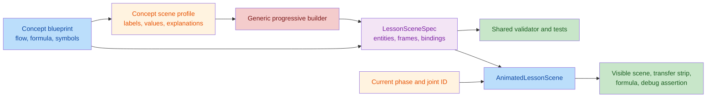

# Concepts Step-Animation Review (40001-40036)

> **Resolution update (2026-08-31): SUPERSEDED AND CLOSED.** This first-pass report is retained as review history. Its findings were rechecked in the second concept review and then closed by focused semantic tests plus the complete three-viewport browser sweep. See [the final review](guided-step-animation-final-review.md).

## Intent

Implement one directly addressable, reversible visual frame for every concept-lesson flow joint. Each frame should expose topic-specific input, operation, intermediate state, and output; bind every displayed formula symbol to the correct visual entity; and provide assertions that help a beginner diagnose the worked example. Review baseline: current working tree on 2026-08-28, using new/right-side line numbers. No implementation file was modified.

## Findings

Overall verdict: **FAIL**. All 36 IDs exist and pass the structural scene contract, but the implementation does not pass the approved semantic-animation, formula-binding, debug-usefulness, or build gates. Every ID is blocked by B2-B4/M1 below; 18 IDs also have a concrete lesson-level defect.

### Blockers

| No. | Finding | Exact new-file evidence | Required correction |
|---:|---|---|---|
| B1 | **The shared validator does not type-check.** The `range` branch establishes that `expected` is an array, but its two elements retain the `SceneScalar` union, so comparing the numeric state to `range[0]`/`range[1]` raises TS2365. `pnpm exec tsc --noEmit` fails twice on line 272, so the completion definition's TypeScript gate cannot pass. | [lessonSceneTypes.ts:268-273](../../src/config/lessonSceneTypes.ts#L268-L273) | Narrow both tuple members to finite numbers before comparison (or introduce a tuple type guard), and add a compile-level test for malformed range expectations. |
| B2 | **The concept builder fabricates the same positional scalar pipeline for every lesson.** `stepValues[i]` always overwrites entity `(i+1) mod count`; every frame then treats entities `i` and `i+1` as one source/target pair, adds the next edge of a fixed linear chain, and invents exactly one transfer. This makes pointer rewiring, wait-for cycles, CFGs, parser stacks, pipeline occupancy, branches, and cache lookup all share the same causal model. Several resulting transfers are false (for example, a SQL estimated-cost scalar is “transferred” into actual row count). This is the core behavior the approved spec forbids: the builder is repackaging ordered labels rather than modeling topic state. | [concept profile.ts:41-49](../../src/config/lessonScenes/concepts/profile.ts#L41-L49), [progressiveLessonScene.ts:164-207](../../src/config/sceneBuilders/progressiveLessonScene.ts#L164-L207) | Author topic-appropriate frame state and operations (or narrowly scoped semantic builders). Transfers must represent actual payload movement; topology/position/visibility changes must represent the taught structure. |
| B3 | **Most declared topology and all transfers are disconnected from the visual canvas.** Only `GraphScene` reads `visibleConnectionIds`; the array, matrix, sequence, and pipeline renderers ignore them. All transfers animate as a separate summary-row dot rather than along the declared `from -> to` entities. Thus 27/36 concept lessons can change a connection in the semantic signature without displaying that connection, and none displays a transfer on its scene geometry. | [AnimatedLessonScene.tsx:78-103](../../src/components/visualizers/AnimatedLessonScene.tsx#L78-L103), [AnimatedLessonScene.tsx:153-220](../../src/components/visualizers/AnimatedLessonScene.tsx#L153-L220), [AnimatedLessonScene.tsx:312-330](../../src/components/visualizers/AnimatedLessonScene.tsx#L312-L330) | Render visible connections and payload motion in each scene grammar, anchored to the source and target entities. Do not count a detached legend animation as the frame's semantic visual change. |
| B4 | **Formula bindings are positional, semantically false, and not shown.** Every symbol is bound to `entityIds[index % entityCount]`, regardless of meaning. For 40001 this binds `A[i]` to “内存分配起点”, `w` to “偏移 i*w”, and `i` to “目标地址”; for 40018 the duration terms bind to cumulative timestamps; 40029 wraps 12 symbols over five unrelated counters. The UI renders the formula separately and never consumes `formulaBindings`, so the promised formula-to-scene mapping is absent. | [progressiveLessonScene.ts:217-220](../../src/config/sceneBuilders/progressiveLessonScene.ts#L217-L220), [GuidedLessonVisualizer.tsx:122-128](../../src/components/visualizers/GuidedLessonVisualizer.tsx#L122-L128) | Require explicit per-profile bindings to semantically matching entities, show those bindings during formula/symbol phases, and test known symbol-to-entity/value relationships rather than only symbol-set equality. |

### Major

| No. | Lesson(s) | Finding | Exact new-file evidence | Required correction |
|---:|---:|---|---|---|
| M1 | 40001-40036 | **Debug assertions cannot diagnose a bad computation.** Every frame gets exactly one assertion whose expected value is copied from the same `targetValue` used to create the authoritative state. The debug UI then prints only that expected value; it neither evaluates nor displays an actual/pass/fail result. In the debug phase only the final frame is visible, so requested checks such as balance conservation, pointer integrity, field-width sums, parser exhaustion, or per-stage pipeline state are unavailable. | [progressiveLessonScene.ts:202-207](../../src/config/sceneBuilders/progressiveLessonScene.ts#L202-L207), [AnimatedLessonScene.tsx:340-347](../../src/components/visualizers/AnimatedLessonScene.tsx#L340-L347) | Define independent, lesson-specific assertions over meaningful intermediates and render actual versus expected plus pass/fail. Include multiple assertions when the lesson's debug tip names multiple invariants. |
| M2 | 40002 | **The final linked-list graph shows the wrong links.** The explanation requires `20 -> 25 -> 30`, but the fixed entity-order chain retains `20 -> 30` and adds `30 -> 25`; no existing pointer is removed. The animation therefore teaches the opposite rewiring direction. | [dataStructuresAlgorithms.ts:21-31](../../src/config/lessonScenes/concepts/dataStructuresAlgorithms.ts#L21-L31), [progressiveLessonScene.ts:164-190](../../src/config/sceneBuilders/progressiveLessonScene.ts#L164-L190) | Model nodes and `next` edges directly, hide/remove `20 -> 30`, then reveal `25 -> 30` and `20 -> 25` in the correct order. |
| M3 | 40003 | **The stack/queue comparison only executes the stack branch.** The authoritative output becomes `3` and the last frame updates the stack top to `2`; the queue output `1` remains a prefilled static label. Worse, the positional formula binding associates `x_queue` with the shared “本次移出值” entity, whose value is `3`. | [dataStructuresAlgorithms.ts:35-46](../../src/config/lessonScenes/concepts/dataStructuresAlgorithms.ts#L35-L46) | Show parallel stack and queue tracks for input `[1,2,3]`, with independently visible outputs `3` and `1` and independent top/front updates. |
| M4 | 40005 | **The graph-search termination frame has no real target-state change.** “剩余前沿数” starts at `0` and is written as `0` again; “已检查邻接边数” remains `0` even after the explanation says three edges were checked. The frame passes only because the builder rotates a transfer and adds a generic edge. | [dataStructuresAlgorithms.ts:66-77](../../src/config/lessonScenes/concepts/dataStructuresAlgorithms.ts#L66-L77) | Represent the frontier contents, visited set, current vertex, and scanned edges per round; make termination follow a non-empty-to-empty frontier transition. |
| M5 | 40014 | **The routing state cannot represent the stated address or forwarding decision.** The entity labeled destination address contains numeric `10`, while the explanation uses `10.1.2.9`; next-hop `7` is prefilled and never becomes a source or target. The final visual operation only changes TTL, so longest-prefix selection never visibly produces `r*`/next hop. | [networks.ts:20-31](../../src/config/lessonScenes/concepts/networks.ts#L20-L31) | Permit string/structured profile values, show all candidate prefixes and matches, then visibly select `/24`, next hop `7`, and TTL `63`. |
| M6 | 40015 | **The first TCP frame contradicts its explanation.** Its displayed input is “需要重传的 SEQ = 0”, yet the same frame says the sender transmits `SEQ=100` and computes `[100,104)`. `100` is written into that entity only in the final retransmission frame. | [networks.ts:35-45](../../src/config/lessonScenes/concepts/networks.ts#L35-L45) | Separate current segment `SEQ=100` from a later retransmission marker; preserve the sent and out-of-order intervals so ACK progression is reconstructible. |
| M7 | 40016 | **The congestion-window example starts from the wrong authoritative input.** Frame 1 reads “丢包后的 cwnd = 0”, while its explanation and update formula require current `cwnd=8`. There is no visual entity for current `cwnd` or `MSS=1`; the final halved value is being reused as the first input slot. | [networks.ts:49-59](../../src/config/lessonScenes/concepts/networks.ts#L49-L59) | Model current cwnd, MSS, in-flight amount, ACK-updated cwnd, and loss-updated cwnd as distinct values and bind the formula to them. |
| M8 | 40021 | **The transaction's authoritative balances violate its own conservation equation.** In the update frame A/B remain `100/50` despite prose saying `70/80`; the final frame changes only B, leaving `100/80`, so the visible sum is `180`, not the claimed invariant `150`. | [databases.ts:36-46](../../src/config/lessonScenes/concepts/databases.ts#L36-L46) | Store both account balances in every frame and atomically transition `100/50 -> 70/80`; assert both values, commit state, and `A+B=150`. |
| M9 | 40025 | **`age+1` is reported as two output tokens.** A correct scan yields identifier `age`, plus, and numeric literal `1` (three tokens), but the last frame sets “已输出 token 数” to `2` and says only identifier/plus were output. | [compiler.ts:5-16](../../src/config/lessonScenes/concepts/compiler.ts#L5-L16) | Continue the scan through `1`, emit the numeric token, and show all three token spans/types. |
| M10 | 40026 | **The parser claims acceptance while its visible machine state remains near the start.** In the final frame, remaining-input count is still `5`, stack-symbol count `4`, and matched-token count `1`; only an AST root code changes. That contradicts EOF acceptance of all five tokens. | [compiler.ts:20-31](../../src/config/lessonScenes/concepts/compiler.ts#L20-L31) | Use full snapshots for stack, remaining input, matched count, selected production, and incrementally built AST; final state must have empty input/accepting stack. |
| M11 | 40029 | **The explained constant result `y=6` never exists in visual state.** The third frame changes “本轮更新环境数” to `2`; the only constant-value entity remains `4`. A learner cannot verify `4+2=6`, inspect IN/OUT environments, or observe convergence. | [compiler.ts:65-76](../../src/config/lessonScenes/concepts/compiler.ts#L65-L76) | Represent per-block/per-variable lattice values and expose `x=4`, `y=6`, changed environments, and consecutive equal iterations. |
| M12 | 40030 | **The final allocator state says both `S` is empty and spill count is one.** “本轮溢出值数” is set to `1` in frame 3 and never cleared, yet frame 5 states reallocation ended with `S=empty`. | [compiler.ts:80-91](../../src/config/lessonScenes/concepts/compiler.ts#L80-L91) | Use a second-round snapshot that clears `S`, rebuilds interference/liveness, and shows the final register or stack location of each value. |
| M13 | 40031 | **The displayed instruction fields cannot sum to the displayed 32-bit word.** The scene retains opcode width `7`, aggregate register width `15`, and immediate width `12`, which total `34`. For RISC-V `addi`, there is no `rs2`; the missing `funct3` field is 3 bits, so the consistent I-type split is `7+5+3+5+12=32`. | [computerArchitecture.ts:5-17](../../src/config/lessonScenes/concepts/computerArchitecture.ts#L5-L17), [computerArchitecture blueprint.ts:19-24](../../src/config/conceptLessonBlueprints/computerArchitecture.ts#L19-L24) | Make the formula and entities describe one concrete ISA format, include `funct3`, remove `rs2` for `addi`, and assert the exact field-width sum. |
| M14 | 40035 | **The branch lesson reveals outcomes before prediction and never displays the predicted direction.** `y_t=1` and correct target PC `400` are visible in the first frame; the “predict direction” frame merely rewrites the already-visible counter `1`, while prediction `0` exists only in prose. The resolution frame likewise rewrites the already-visible `y_t=1`. | [computerArchitecture.ts:76-88](../../src/config/lessonScenes/concepts/computerArchitecture.ts#L76-L88) | Hide future truth/target until resolution, add an explicit predicted-direction entity, then show counter update and misprediction-only flush as separate causal changes. |

### Moderate

| No. | Lesson(s) | Finding | Exact new-file evidence | Required correction |
|---:|---:|---|---|---|
| N1 | 40017, 40023, 40035, 40036 | **Future results are visible from frame 1.** `frameStates` marks every entity visible in every frame. Profiles prefill DNS returned address `34`, actual query rows `120`, branch truth/target `1/400`, and core local sums `15/40`; learners see answers before the causative steps. The runtime audit found all 915 concept entity states visible. | [progressiveLessonScene.ts:127-138](../../src/config/sceneBuilders/progressiveLessonScene.ts#L127-L138), [networks.ts:63-74](../../src/config/lessonScenes/concepts/networks.ts#L63-L74), [databases.ts:65-77](../../src/config/lessonScenes/concepts/databases.ts#L65-L77), [computerArchitecture.ts:76-104](../../src/config/lessonScenes/concepts/computerArchitecture.ts#L76-L104) | Set per-frame visibility explicitly and reveal derived/intermediate values only after their operation. |
| N2 | 40022 | **The version count and explanation disagree.** The scene keeps “检查过的版本数 = 2” while saying the third candidate was tested and returned. The number is valid only if relabeled “rejected versions”, not “checked versions”. | [databases.ts:50-61](../../src/config/lessonScenes/concepts/databases.ts#L50-L61) | Change the value to `3` when the third version is checked, or rename the metric and expose all three begin/end timestamps. |
| N3 | 40034 | **Mutually exclusive address-translation branches are presented as one reversible state history.** After the page-fault frame records frame `7`, the protection branch resets that result to `0`; the final “retry” then computes with frame `7` only in prose while authoritative state still says fault result `0`. | [computerArchitecture.ts:57-71](../../src/config/lessonScenes/concepts/computerArchitecture.ts#L57-L71) | Model branch alternatives explicitly, or keep one continuous miss -> page fault -> retry trace and move the protection failure to a separate branch/example. |

## Coverage

All IDs inherit B2-B4 and M1, so every row is currently **FAIL** overall. “No extra defect” means no additional lesson-specific contradiction was found after checking the blueprint formula, profile snapshots, generated frames, and course order; it does not waive the shared blockers.

| ID | Topic | Additional finding | ID | Topic | Additional finding |
|---:|---|---|---:|---|---|
| 40001 | Arrays/locality | No extra defect | 40019 | Relational model | No extra defect |
| 40002 | Linked lists | M2 | 40020 | B+ tree | No extra defect |
| 40003 | Stacks/queues | M3 | 40021 | ACID | M8 |
| 40004 | Tree traversal | No extra defect | 40022 | MVCC | N2 |
| 40005 | Graph search | M4 | 40023 | Query optimization | N1 |
| 40006 | Dynamic programming | No extra defect | 40024 | Replication/sharding | No extra defect |
| 40007 | Processes/threads | No extra defect | 40025 | Lexing | M9 |
| 40008 | Context switching | No extra defect | 40026 | Parsing/AST | M10 |
| 40009 | Scheduling | No extra defect | 40027 | Semantic/type checks | No extra defect |
| 40010 | Virtual memory | No extra defect | 40028 | IR/SSA | No extra defect |
| 40011 | Synchronization/deadlock | No extra defect | 40029 | Constant propagation | M11 |
| 40012 | File systems/I/O | No extra defect | 40030 | Register allocation | M12 |
| 40013 | Layering/encapsulation | No extra defect | 40031 | Instruction encoding | M13 |
| 40014 | IP/routing | M5 | 40032 | CPU pipeline | No extra defect |
| 40015 | TCP reliability | M6 | 40033 | Cache hierarchy | No extra defect |
| 40016 | Congestion control | M7 | 40034 | Address translation | N3 |
| 40017 | DNS | N1 | 40035 | Branch prediction | M14, N1 |
| 40018 | HTTP/TLS | No extra defect | 40036 | SIMD/multicore | N1 |

The macro learning order is coherent: data structures/algorithms -> operating systems -> networks -> databases -> compiler -> architecture. Within architecture, the actual order `40031 -> 40032 -> 40035 -> 40033 -> 40034 -> 40036` sensibly places branch prediction after pipelining. The blocker is the per-frame causal progression, not the book-level ordering.

## Check Evidence

- Read in full: approved animation design, scene protocol/validator, generic builder, shared renderer, guided step resolver, all six concept blueprint files, all six concept scene-profile files, concept registry, and relevant unit/E2E sources.
- Runtime inventory: 36 lessons, 164 frames, 915 entity states, 167 formula bindings. All 164 frames have exactly one source, one target, one transfer, and one generated assertion; zero frames have `operation.expression`; zero entity states are hidden.
- Custom frame reconstruction confirmed seven transitions whose target value does not change: 40005 frame 4; 40010 frames 2-3; 40023 frame 5; 40033 frame 2; 40035 frames 2 and 4. Their contract signatures change through generated edges/transfers instead.
- `node --experimental-strip-types --test tests/lessonSceneTypes.test.ts tests/guidedLessonScenes.contract.test.ts`: **7/7 passed**. This proves shape/reference invariants and signature differences, not domain semantics.
- `node --experimental-strip-types --test tests/fullCourseBlueprints.test.ts tests/katexSources.test.ts tests/visualizationCoverage.test.ts`: **10/10 passed**. All formulas parse and all routes resolve.
- Focused ESLint over the shared protocol/builder/renderer and concept scenes: **passed with zero warnings**.
- `git diff --check` over reviewed implementation/test paths: **passed**.
- `pnpm exec tsc --noEmit`: **failed** with two TS2365 diagnostics at `src/config/lessonSceneTypes.ts:272` (B1).
- Browser E2E was not run because its configured reporters/output directory write artifacts, while this review permits only this report to be written. Source inspection also shows concept routes participate only in the all-route first/last smoke loop; the representative screenshot/layout routes contain no concept lesson.
- The requested skill's two-validator sub-agent facility was unavailable in this session. Its documented fallback was used: every candidate was re-read against the generated runtime frame, weak/style-only candidates were removed, and only reproducible findings remain.

Residual risk after the listed fixes: automated tests still need lesson-specific expected snapshots (not only structural signatures), formula-binding assertions, and representative concept browser routes at desktop/mobile widths. Until those exist, a generic transfer or prefilled result can regress while the current contract remains green.
