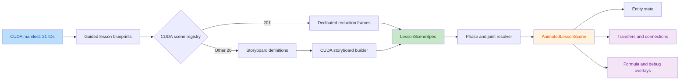

# CUDA Step Animation Review

> **Resolution update (2026-08-31): CLOSED.** This report preserves the independent pre-fix findings. The current renderer anchors connection and transfer overlays to measured scene entities, while the scene protocol keeps explicit pre-operation snapshots and independent expected values. The cited scalar-tail, ping/pong, scan, radix, padding and clamp cases now have focused regression tests. All 21 lessons and 116 joints, including CUDA 201's seven frames, pass the final three-viewport browser sweep. See [the final review](guided-step-animation-final-review.md).

## Intent

Intent: provide deterministic, frame-addressable animations for the 21 guided CUDA lessons, backed by one shared scene protocol and renderer. CUDA 201 uses a dedicated seven-frame reduction scene; the other 20 lessons use topic-specific storyboard definitions compiled by the shared CUDA builder.

Review result: no critical findings; 3 high-severity and 4 medium-severity findings remain. The manifest/scene contracts and CUDA 201's required numeric storyboard pass, but the rendered data flow, before/after snapshots, formula linkage, and debug presentation do not yet fully meet the approved design.

## Findings

| No. | Issue Title | Suggestion | Code Link |
| --- | --- | --- | --- |
| 1 | **High: Transfers and topology are not animated between their scene entities.** `VisualScene` ends at the canvas boundary, then every transfer is rendered in a separate list row whose dot moves only from `0%` to the width of that row. The row prints the `from` and `to` labels but never locates those entities, and the CUDA `array`, `matrix`, and `pipeline` renderers do not render `visibleConnectionIds`. Consequently, CUDA 201's twelve correct operand transfers are shown as detached rows rather than as the required reduction-tree paths, and this affects all 21 CUDA scenes. | Draw connections and transfer pulses inside the scene canvas, anchored to the actual `[data-scene-entity]` source and target boxes. Keep the textual list only as an accessible companion, not the visual representation of movement. | [AnimatedLessonScene.tsx:342](/Users/bytedance/MyProject/algo-vis/src/components/visualizers/AnimatedLessonScene.tsx:342) `[342,355]`; [AnimatedLessonScene.tsx:358](/Users/bytedance/MyProject/algo-vis/src/components/visualizers/AnimatedLessonScene.tsx:358) `[358,375]` |
| 2 | **High: In-place operations lose their pre-operation input value.** The builder mutates `values` before taking `snapshot`, and derives both `inputs` and `outputs` from that post-operation snapshot. Runtime inspection therefore shows CUDA 303's clear step as `[0,0,0,0] -> [0,0,0,0]` instead of `[9,9,9,9] -> [0,0,0,0]`; CUDA 602 similarly hides both `[9,9,9] -> [0,0,0]` and the atomic accumulation's zero starting state. CUDA 401's second accumulator update also presents the final accumulator as its own input. The dedicated CUDA 201 barrier frame has the same alignment defect: its result says `waiting -> released`, but both its input datum and current state already say `released`. The result/explanation claims a change that the structured visual data does not show. | Preserve before and after snapshots. Resolve an entity that is both source and target from the before snapshot in `inputs`, while `outputs` and `entityStates` use the after snapshot; provide an explicit input override for steps that intentionally establish a source value in the same frame. Add contract assertions for the 201 barrier transition, sentinel-to-zero transitions, and accumulator transitions. | [storyboard.ts:156](/Users/bytedance/MyProject/algo-vis/src/config/lessonScenes/cuda/storyboard.ts:156) `[156,175]`; [reduction201.ts:248](/Users/bytedance/MyProject/algo-vis/src/config/lessonScenes/cuda/reduction201.ts:248) `[248,275]`; [scanSortScenes.ts:202](/Users/bytedance/MyProject/algo-vis/src/config/lessonScenes/cuda/scanSortScenes.ts:202) `[202,208]`; [reshapeScenes.ts:129](/Users/bytedance/MyProject/algo-vis/src/config/lessonScenes/cuda/reshapeScenes.ts:129) `[129,155]` |
| 3 | **High: Automatic transfer pairing fabricates incorrect CUDA data provenance.** When source and target counts differ, `routesForStep` cycles each list by index. For CUDA 105 this generates `vector-load -> half-tail` with the four-value main-vector payload, although the tail value `2.5` comes from `input[4]` under `tail-mask`. For CUDA 401 it generates paths such as `ping-b -> pong-a`, `A -> pong-b`, and `B -> accumulator`, which contradict the stated concurrent compute/prefetch operation. Similar ambiguous routes occur throughout generated scenes, so an animated implementation of these endpoints would teach false dependencies. | Require explicit transfers for ambiguous many-to-many steps. Safe defaults can cover one-to-many, many-to-one, or equal-cardinality pairs, but mismatched many-to-many definitions should fail validation. Add exact endpoint/payload tests for CUDA 105 and 401. | [storyboard.ts:67](/Users/bytedance/MyProject/algo-vis/src/config/lessonScenes/cuda/storyboard.ts:67) `[67,74]`; [elementWiseScenes.ts:231](/Users/bytedance/MyProject/algo-vis/src/config/lessonScenes/cuda/elementWiseScenes.ts:231) `[231,238]`; [matrixScenes.ts:51](/Users/bytedance/MyProject/algo-vis/src/config/lessonScenes/cuda/matrixScenes.ts:51) `[51,61]` |
| 4 | **Medium: Formula bindings are validated but never rendered as bindings.** The formula panel renders only the LaTeX string, and the symbol cards render only symbol/meaning text. A source search finds `formulaBindings` in builders, protocol validation, and tests, but no component consumes it. Thus formula phase does not map symbols to the corresponding visible CUDA entities, including `x_i`, `N`, and `S` in lesson 201. | During symbol/formula/summary phases, consume `scene.formulaBindings` to mark or highlight each bound entity and expose an accessible symbol-to-entity mapping. Add a component/E2E assertion that activating a symbol identifies its bound scene entities. | [GuidedLessonVisualizer.tsx:122](/Users/bytedance/MyProject/algo-vis/src/components/visualizers/GuidedLessonVisualizer.tsx:122) `[122,128]`; [GuidedLessonVisualizer.tsx:174](/Users/bytedance/MyProject/algo-vis/src/components/visualizers/GuidedLessonVisualizer.tsx:174) `[174,197]`; [storyboard.ts:222](/Users/bytedance/MyProject/algo-vis/src/config/lessonScenes/cuda/storyboard.ts:222) `[222,230]` |
| 5 | **Medium: The debug phase exposes only the final assertion, not the intermediate checks it promises.** Debug resolves to the last frame and `showDebug` is true only in that phase, while both the generic builder and CUDA 201 attach one assertion to each individual frame. Those earlier assertions can never be displayed. For lesson 201, debug therefore shows only `grid-sum = 36`, not the barrier state, pair sums, half sums, or block partial requested by its debug guidance. | Keep the required last-frame debug scene, but aggregate the lesson's key intermediate assertions into its debug presentation, or add a debug-only frame selector that leaves assertions visible. For CUDA 201, expose checks for barrier release, `[3,7,11,15]`, `[10,26]`, block partial `36`, and final `36`. | [guidedLessonTypes.ts:98](/Users/bytedance/MyProject/algo-vis/src/config/guidedLessonTypes.ts:98) `[98,108]`; [AnimatedLessonScene.tsx:388](/Users/bytedance/MyProject/algo-vis/src/components/visualizers/AnimatedLessonScene.tsx:388) `[388,395]`; [reduction201.ts:190](/Users/bytedance/MyProject/algo-vis/src/config/lessonScenes/cuda/reduction201.ts:190) `[190,203]` |
| 6 | **Medium: Multi-round scan/sort state is collapsed into prose or a final jump.** CUDA 301 stores only the final prefix in the entity state while its result string lists the distance-1/2/4 rounds. CUDA 302 correctly shows the bit-0 scatter `[4,2,3,1]`, then changes directly to fully sorted `[1,2,3,4]` and `all uint32 bits complete` without representing any higher-bit digit, rank, position, or buffer state. Beginners cannot trace or debug the rounds that supposedly produce the final value. | Represent each scan distance and each required radix bit as visible state, for example with explicit round-history entities or additional stable joints. If the lesson intentionally demonstrates one radix pass only, stop at the bit-0 buffer and avoid claiming completion of all bits. | [scanSortScenes.ts:45](/Users/bytedance/MyProject/algo-vis/src/config/lessonScenes/cuda/scanSortScenes.ts:45) `[45,51]`; [scanSortScenes.ts:162](/Users/bytedance/MyProject/algo-vis/src/config/lessonScenes/cuda/scanSortScenes.ts:162) `[162,176]` |
| 7 | **Medium: Boundary-focused convolution states use examples that cannot reveal boundary mistakes.** CUDA 501 binds and discusses padding but fixes padding to zero and reports `0 out-of-range reads`, so no zero-padding behavior is visible. CUDA 503 teaches clamp-to-edge using a center impulse whose border values are all zero; its clamp halo is therefore identical to zero padding. Both scenes can pass with an incorrect boundary rule, reducing beginner clarity and debug value. | Include a padding-1 Conv2d state with explicit out-of-range slots, and use or add a corner/nonzero-edge Gaussian example whose repeated clamp halo differs from zero padding. Assert the concrete halo and boundary outputs. | [stencilScenes.ts:19](/Users/bytedance/MyProject/algo-vis/src/config/lessonScenes/cuda/stencilScenes.ts:19) `[19,23]`; [stencilScenes.ts:52](/Users/bytedance/MyProject/algo-vis/src/config/lessonScenes/cuda/stencilScenes.ts:52) `[52,62]`; [stencilScenes.ts:154](/Users/bytedance/MyProject/algo-vis/src/config/lessonScenes/cuda/stencilScenes.ts:154) `[154,187]` |

## Coverage And Check Evidence

### Reviewed Scope

- Approved design: `docs/superpowers/specs/2026-08-28-guided-lesson-step-animation-design.md`.
- Shared protocol and construction/render path: `lessonSceneTypes.ts`, `progressiveLessonScene.ts`, CUDA `storyboard.ts`, `guidedLessonTypes.ts`, `GuidedLessonVisualizer.tsx`, and `AnimatedLessonScene.tsx`.
- CUDA blueprints: all seven blueprint modules and their registry, with detailed comparison of `cudaLessonBlueprints/reduction.ts` to lesson 201.
- CUDA scene implementations: `index.ts`, `storyboard.ts`, `elementWiseScenes.ts`, `reduction201.ts`, `reductionScenes.ts`, `scanSortScenes.ts`, `matrixScenes.ts`, `stencilScenes.ts`, `reshapeScenes.ts`, and `normalizationScenes.ts`.
- Exact manifest set reviewed: `102-106`, `201-203`, `301-303`, `401-403`, `501-503`, `601-602`, `701-702`.

### Structural And Numeric Evidence

| Check | Result |
| --- | --- |
| Runtime scene inventory | 21/21 manifest IDs present; no extras; 116 frames total |
| Protocol validation | `validateLessonScene` returned zero errors for all 21 scenes |
| Scene kinds | 5 array, 9 pipeline, 7 matrix |
| Real-state contract | All 95 adjacent frame pairs have different `semanticSceneSignature` values |
| Transfer/state inventory | 219 transfers and 1,230 complete entity-state snapshots inspected |
| Formula parsing | All 21 lesson formulas and all 14 operation expressions parse with strict KaTeX |
| Focused Node tests | 13 passed, 0 failed: `lessonSceneTypes`, `guidedLessonScenes.contract`, `fullCourseBlueprints` |
| Type check | `pnpm exec tsc --noEmit --pretty false` passed |
| Focused lint | ESLint passed for the reviewed scene, blueprint, protocol, renderer, and focused test files |

CUDA 201 specifically matches the approved data contract: the seven IDs are exact; the barrier visibly changes `waiting -> released`; the tree outputs `[3,7,11,15] -> [10,26]`; its 12 operand transfers carry `1..8`, then `3,7,11,15`; the warp-tail transfers carry `10` and `26`; and both the block partial and final sum are `36`. Its remaining defect is visual projection: those correct endpoints are not drawn along their source-to-result paths, and its intermediate assertions are unavailable in debug phase.

Runtime probes independently confirmed the malformed views cited above: CUDA 201's barrier frame exposes `released` as both input and output despite its transition result; CUDA 303 and 602 clear frames expose identical post-state inputs/outputs; CUDA 105 routes the main `float4` payload to the scalar tail; and CUDA 401 emits the incorrect `ping-b -> pong-a`, `A -> pong-b`, and `B -> accumulator` routes.

The review skill's two-validator sub-agent facility was unavailable in this session, so every candidate finding received a separate fallback self-review against freshly read source and runtime scene output. Lower-confidence style observations were excluded.

### Residual Risks And Test Gaps

- Browser E2E was not rerun because its configured report/screenshot/trace outputs would violate the review's single-file write boundary. Existing E2E source was inspected, but no existing artifact was treated as current evidence.
- Current contract tests prove reference integrity and semantic-signature changes, but do not check whether transfer routes are mathematically meaningful, whether rendered movement follows endpoints, whether formula bindings are consumed, or whether debug phase exposes intermediate assertions.
- Numeric checks cover the fixed examples. They do not supply property-based coverage for alternate sizes, tail widths, multiple blocks, zero-scale L2 input, padded convolution, corner blur, or repeated radix rounds.
