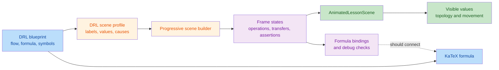

# DRL Step Animation Independent Review

> **Resolution update (2026-08-31): CLOSED.** This report preserves the independent pre-fix findings. The positional generator was replaced by authored causal frames with semantic entities, multi-input operations, explicit formula mappings and independent arithmetic checks. The GAIL and PPO examples were corrected, false lane-adjacency arrows were removed, and the final chapters describe a framework-neutral distributed LLM RL stack. All 36 lessons and 148 joints pass semantic and three-viewport browser coverage. See [the final review](guided-step-animation-final-review.md).

## Intent

Intent: replace the text-only DRL walkthroughs for lessons `30001-30036` with one directly addressable visual frame per blueprint flow joint, so a beginner can follow concrete inputs through a mathematically consistent operation to an observable output, relate formula symbols to the scene, and inspect meaningful debug invariants.



## Verdict

**FAIL.** The registry is complete and passes the structural contracts, but the animation content does not meet the approved semantic acceptance criteria. Three blockers make the displayed derivations incorrect or non-causal, and three major issues prevent the topology, formula bindings, and structured debug view from teaching what the blueprints claim.

## Findings

### BLOCKER 1: A positional template fabricates the operation and transfer graph for all 36 lessons

Every DRL profile supplies only a list of target values. `buildFrameValues` writes value `i` to entity `(i + 1) mod entityCount`, after which the shared builder unconditionally declares entity `i` as the sole source, entity `i + 1` as the sole target, and one transfer carrying the source value. It never receives the actual operands, result entity, transfer endpoints, or equation for a DRL operation ([drl/index.ts:537-545](../../src/config/lessonScenes/drl/index.ts#L537-L545), [drl/index.ts:565-571](../../src/config/lessonScenes/drl/index.ts#L565-L571), [progressiveLessonScene.ts:170-207](../../src/config/sceneBuilders/progressiveLessonScene.ts#L170-L207)).

The generated scene objects confirm that all `148/148` DRL frames have exactly one source, one target, and one source-value transfer; `0/148` have an `operation.expression` or multiple source operands. This produces materially false teaching paths:

- In 30012, the frame named “减去状态基线” outputs the unchanged baseline `0.5`; the centered signal `0.4` appears only in the next frame, whose only declared input is that baseline. The displayed operation never consumes both `G=0.9` and `b=0.5` ([drl/index.ts:179-190](../../src/config/lessonScenes/drl/index.ts#L179-L190)).
- In 30026, “组内标准化” writes the standard deviation, then “用相对优势更新策略” creates the advantage from that standard deviation alone. The reward and mean are absent from the declared operation, and no policy state is updated ([drl/index.ts:373-384](../../src/config/lessonScenes/drl/index.ts#L373-L384)).
- In 30035, a supposedly parallel model/rule scoring stage becomes a serial `request -> model scorer -> rule scorer` chain, and the final reward receives only the rule score, omitting the model score and KL term ([drl/index.ts:501-512](../../src/config/lessonScenes/drl/index.ts#L501-L512)).
- In 30004, 30012, 30014, 30025, 30026, and 30028, the final flow label says a policy or network is updated, but the changed entity is respectively a TD error, centered signal, advantage, clipped objective, standardized advantage, or normalized batch signal. The named model has no resulting visual state ([drl/index.ts:73-83](../../src/config/lessonScenes/drl/index.ts#L73-L83), [drl/index.ts:207-217](../../src/config/lessonScenes/drl/index.ts#L207-L217), [drl/index.ts:359-414](../../src/config/lessonScenes/drl/index.ts#L359-L414)).

This is not a presentation preference: it contradicts the formula operands, causal explanations, and the requirement that semantic changes be projected onto the corresponding entities. Replace the positional frame generator with authored per-frame sources, targets, expressions, transfers, and complete snapshots. Multi-input equations must visibly consume every displayed operand, and update joints must mutate the policy/network quantity they claim to update.

### BLOCKER 2: Lesson 30024's GAIL reward is numerically incompatible with its displayed discriminator

The blueprint defines `D(s,a)` as the probability that a pair came from the expert and gives `r_D=-log(1-D)` ([drlLessonBlueprints.ts:231-236](../../src/config/drlLessonBlueprints.ts#L231-L236)). The scene then displays `D=0.82` and `r_D=0.48` ([drl/index.ts:344-356](../../src/config/lessonScenes/drl/index.ts#L344-L356)). Those values cannot coexist:

```text
-log(1 - 0.82) = 1.714798428...
```

The wrong value teaches the opposite reward scale while the generated equality assertion still reports it as valid. Use a discriminator/reward pair that satisfies the displayed formula and keep the expert-probability convention consistent through the policy update.

### BLOCKER 3: Lesson 30025's PPO clipped objective cannot equal the displayed `0.44`

The scene displays probability ratio `r_t=1.16`, positive advantage `A_t=0.46`, and clipped objective `0.44` ([drl/index.ts:359-370](../../src/config/lessonScenes/drl/index.ts#L359-L370)), while the blueprint uses the standard minimum of `r_t A_t` and `clip(r_t,1-epsilon,1+epsilon) A_t` ([drlLessonBlueprints.ts:240-245](../../src/config/drlLessonBlueprints.ts#L240-L245)). Here the unclipped term is `1.16 * 0.46 = 0.5336`. For any valid `epsilon >= 0`, the positive-advantage clipped term is at least `1.0 * 0.46 = 0.46`, so the minimum cannot be `0.44`.

Give `epsilon` a concrete visible value and derive the target from it. For example, `epsilon=0.1` produces `1.1 * 0.46 = 0.506`; `epsilon=0.2` leaves the `0.5336` term unclipped.

### MAJOR 1: Sequence and pipeline canvases ignore declared frame topology; pipeline arrows are often false

The sequence renderer lays out cards without reading `connections` or `visibleConnectionIds` ([AnimatedLessonScene.tsx:164-179](../../src/components/visualizers/AnimatedLessonScene.tsx#L164-L179)). The pipeline renderer also ignores both fields and draws arrows between adjacent cards within each visual lane instead ([AnimatedLessonScene.tsx:183-203](../../src/components/visualizers/AnimatedLessonScene.tsx#L183-L203)). DRL lane assignment is presentation metadata applied after the builder creates a sequential connection graph ([drl/index.ts:589-604](../../src/config/lessonScenes/drl/index.ts#L589-L604)).

Focused comparison found declared-versus-drawn mismatches in all seven pipeline lessons `30030-30036`. For 30030, the declared path is `entity-0 -> entity-1 -> entity-2 -> entity-3`, while its lane assignment causes the canvas to draw `entity-0 -> entity-3` and `entity-1 -> entity-2`, omitting two declared edges and inventing one ([drl/index.ts:431-443](../../src/config/lessonScenes/drl/index.ts#L431-L443)). The six sequence lessons `30008, 30013, 30015, 30017, 30023, 30029` display no topology at all.

Render the frame's declared visible connections and animate transfers between the actual source and target cards. Lane/track grouping must not create semantic arrows by adjacency.

### MAJOR 2: Formula bindings are unused at runtime and several bindings map symbols to the wrong quantity

The DRL registry constructs `formulaBindings` ([drl/index.ts:574-578](../../src/config/lessonScenes/drl/index.ts#L574-L578)), but no renderer consumes them. The user-visible formula is rendered directly from `blueprint.formula`, independently of scene entities ([GuidedLessonVisualizer.tsx:122-128](../../src/components/visualizers/GuidedLessonVisualizer.tsx#L122-L128)); a repository search found no component reference to `formulaBindings`.

Several index mappings would also be misleading if binding visualization were added:

- 30001 binds both `gamma` and `G_t` to the combined “折扣因子 γ 与回报 G0” entity, whose final value is `2.8` ([drl/index.ts:33-38](../../src/config/lessonScenes/drl/index.ts#L33-L38)).
- 30005 binds `c_puct` to the policy-prior entity; 30006 binds `alpha` to the updated-Q entity ([drl/index.ts:86-104](../../src/config/lessonScenes/drl/index.ts#L86-L104)).
- 30023 binds `lambda` to the combined reward-parameter entity, and 30035 binds `beta` to the final reward rather than a KL weight ([drl/index.ts:329-334](../../src/config/lessonScenes/drl/index.ts#L329-L334), [drl/index.ts:501-506](../../src/config/lessonScenes/drl/index.ts#L501-L506)).

Render each formula binding against the current entity state and give parameters or operands their own semantically exact entities. A binding should never make a coefficient appear to equal an output value.

### MAJOR 3: All structured debug assertions are tautologies rather than diagnostic checks

The shared builder creates exactly one assertion per frame by copying the generated target value into both the entity state and `expected` field ([progressiveLessonScene.ts:202-207](../../src/config/sceneBuilders/progressiveLessonScene.ts#L202-L207)). The validator then checks that the copied values equal each other ([lessonSceneTypes.ts:252-280](../../src/config/lessonSceneTypes.ts#L252-L280)). In debug mode, the UI prints only “expected value”; it does not show actual versus expected, evaluate pass/fail, or expose the formula operands that produced the value ([AnimatedLessonScene.tsx:348-360](../../src/components/visualizers/AnimatedLessonScene.tsx#L348-L360)).

Consequently, the incorrect GAIL and PPO numbers pass every assertion. All `148` frames have this same one-assertion pattern. Author assertions around independent invariants and intermediate values, such as recomputed reward, probability normalization, finite log-prob differences, version equality, occupancy differences, or checksum preservation, and render their evaluated status.

## Per-ID Coverage

Codes refer to the findings above. `B1`, `M2`, and `M3` apply to every lesson because every scene is generated by the same positional builder, every formula binding is disconnected from rendering, and every debug assertion is generated from its own target.

| ID | Result | ID | Result | ID | Result |
|---:|---|---:|---|---:|---|
| 30001 | B1, M2, M3 | 30013 | B1, M1, M2, M3 | 30025 | B1, B3, M2, M3 |
| 30002 | B1, M2, M3 | 30014 | B1, M2, M3 | 30026 | B1, M2, M3 |
| 30003 | B1, M2, M3 | 30015 | B1, M1, M2, M3 | 30027 | B1, M2, M3 |
| 30004 | B1, M2, M3 | 30016 | B1, M2, M3 | 30028 | B1, M2, M3 |
| 30005 | B1, M2, M3 | 30017 | B1, M1, M2, M3 | 30029 | B1, M1, M2, M3 |
| 30006 | B1, M2, M3 | 30018 | B1, M2, M3 | 30030 | B1, M1, M2, M3 |
| 30007 | B1, M2, M3 | 30019 | B1, M2, M3 | 30031 | B1, M1, M2, M3 |
| 30008 | B1, M1, M2, M3 | 30020 | B1, M2, M3 | 30032 | B1, M1, M2, M3 |
| 30009 | B1, M2, M3 | 30021 | B1, M2, M3 | 30033 | B1, M1, M2, M3 |
| 30010 | B1, M2, M3 | 30022 | B1, M2, M3 | 30034 | B1, M1, M2, M3 |
| 30011 | B1, M2, M3 | 30023 | B1, M1, M2, M3 | 30035 | B1, M1, M2, M3 |
| 30012 | B1, M2, M3 | 30024 | B1, B2, M2, M3 | 30036 | B1, M1, M2, M3 |

No additional hard arithmetic contradiction was found beyond 30024 and 30025. That does not validate the other displayed results: B1 means most cannot be recomputed from the operands exposed by their own frame.

## Coverage And Check Evidence

Reviewed in full:

- Approved design specification, including scene invariants, semantic state-change rules, formula bindings, debug assertions, DRL content strategy, renderer duties, and acceptance gates.
- Shared scene protocol and validator, progressive scene builder, guided step resolver, shared animated renderer, and DRL wrapper.
- All DRL blueprints and all scene profiles/constructed frames for IDs `30001-30036`.

Focused read-only checks:

| Check | Result |
|---|---|
| DRL/scene contract tests | **PASS, 5/5**: `tests/drlLessonBlueprints.test.ts` and `tests/guidedLessonScenes.contract.test.ts` |
| TypeScript | **PASS**: `pnpm exec tsc --noEmit` |
| Focused ESLint | **PASS** for DRL blueprints/scenes, scene builder, and scene protocol |
| Scene registration | **PASS**: exactly 36 lessons, IDs `30001-30036` |
| Kind coverage | 12 graph, 11 distribution, 6 sequence, 7 pipeline |
| Protocol validation | **PASS**: `36/36` scenes report no `validateLessonScene` errors |
| Adjacent semantic signatures | **PASS structurally**: `0` identical adjacent signatures |
| Frame audit | 148 frames; 148 single-source operations; 0 multi-source operations; 0 operation expressions |
| Structured assertions | 148 assertions for 148 frames; every assertion is the generated target-equality pattern |
| Pipeline topology comparison | **FAIL semantically**: all `7/7` pipeline lessons have missing or invented canvas arrows |
| Numeric spot calculations | GAIL expected `1.714798...`, displayed `0.48`; PPO lower bound `0.46`, displayed `0.44`; GRPO and A2C spot calculations agree after rounding |
| Diff hygiene | `git diff --check` **PASS** for the reviewed implementation files |

Nine adjacent transitions (`30006/2`, `30007/2`, `30010/2`, `30012/3`, `30014/2`, `30024/2`, `30031/2`, `30031/4`, `30036/4`) have no entity-value, visibility, or position delta and pass only because the template changes a connection/transfer. Because B1 shows those transfers are positional rather than authored semantic events, the structural signature test overstates real animation coverage.

Browser/E2E checks were not run: the existing Playwright configuration writes reports, traces, screenshots, and other artifacts, while this review's only permitted write is this document. This leaves responsive layout, overlap, and actual transition rendering as residual risks after the content blockers are fixed.

The requested review skill's two-sub-agent validation step was unavailable because this session exposed no sub-agent dispatch tools. Findings were therefore challenged in two independent self-review passes: first by extracting and recomputing all emitted scene objects, then by re-reading each candidate against the approved acceptance criteria and renderer code. Only findings confirmed in both passes are included.
