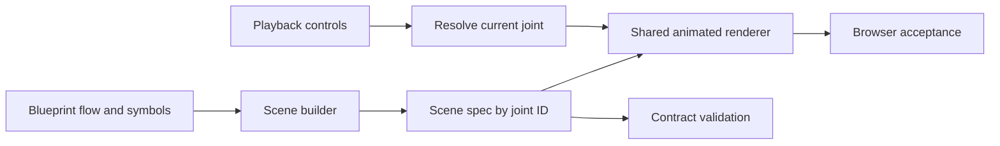

# Shared Step Animation Engine Review

> **Resolution update (2026-08-31): CLOSED.** This report preserves the independent pre-fix shared-engine findings. The current protocol validates authoritative pre/post values and transfer source snapshots, all six grammars render measured connection/transfer overlays, formula bindings are visible, distribution entities share status/accessibility semantics, and frame order comes from blueprint flow IDs. The final acceptance suite covers every joint on all 156 routes at three viewports. See [the final review](guided-step-animation-final-review.md).

Review snapshot: 2026-08-28 16:33 CST. Scope: the approved guided-lesson animation design, the shared scene renderer and lesson wrapper, the scene protocol/validator, the progressive scene builder, and the automated checks that claim to enforce that design. This was an independent read-only implementation review; no implementation or test file was changed.

Overall verdict: **FAIL**. The shared engine now renders real changing DOM/SVG state and uses one navigation state source, but the generic builder fabricates causal edges and formula bindings for 135 of 156 lessons. The shared validator accepts those scenes because it verifies structural change, not whether the rendered computation matches the lesson. Newly added domain semantic tests correctly reject the current data, leaving the suite RED.

## Intent And Execution Flow

The approved intent is one addressable visual frame per flow joint, with reversible controls resolving a joint ID from the single playback step, then projecting actual values, movement, topology, transfers, formula bindings, and debug checks into a stable and accessible scene.

## Findings

### BLOCKER 1: The progressive builder invents a positional dataflow instead of encoding the lesson computation

For every joint, the builder chooses `source = entity[index]` and `target = entity[index + 1]`, emits exactly one source, one target, and one transfer, then labels that synthetic edge with the lesson prose ([progressiveLessonScene.ts:170](../../src/config/sceneBuilders/progressiveLessonScene.ts#L170), [progressiveLessonScene.ts:182](../../src/config/sceneBuilders/progressiveLessonScene.ts#L182), [progressiveLessonScene.ts:191](../../src/config/sceneBuilders/progressiveLessonScene.ts#L191)). The supplied frame snapshots only replace numbers; they cannot describe multi-input operations or true dependencies ([progressiveLessonScene.ts:157](../../src/config/sceneBuilders/progressiveLessonScene.ts#L157)).

The runtime probe for AI 10082 demonstrates the impact. Its first joint, “读取当前输入”, renders `新隐藏状态 h_t (0) -> 当前输入 x_t (0.6)`, reversing cause and result. Its “完成两路线性变换” joint renders only `h_(t-1) -> a_t`, omitting the required `x_t` path. The same builder creates all 63 AI, 36 concept, and 36 DRL scenes: 135 of 156 routes.

This is a correctness blocker, not a prose-quality issue: the animation visibly teaches false computation. Replace the cyclic synthesis with per-joint structured profiles for sources, targets, outputs, transfers, expressions, and expected checks. A convenience builder may validate or normalize those profiles, but must not infer causality from array position.

### HIGH 2: Formula bindings are positional and visibly wrong

Every symbol is bound to `entityIds[index]`, independent of its meaning ([progressiveLessonScene.ts:217](../../src/config/sceneBuilders/progressiveLessonScene.ts#L217)). The UI then presents that association as an explicit formula-to-entity chip ([GuidedLessonVisualizer.tsx:129](../../src/components/visualizers/GuidedLessonVisualizer.tsx#L129)). In AI 10082 this produces four incorrect bindings: `x_t -> 新隐藏状态 h_t`, `h_{t-1} -> 当前输入 x_t`, `a_t -> 上一状态 h_(t-1)`, and `h_t -> 线性和 a_t`.

Validation only proves that symbols and entity IDs exist and are visible ([lessonSceneTypes.ts:231](../../src/config/lessonSceneTypes.ts#L231), [lessonSceneTypes.ts:301](../../src/config/lessonSceneTypes.ts#L301)); it cannot prove that the association is semantically correct. Require explicit formula bindings in each domain profile and add representative semantic assertions beyond CUDA 201.

### HIGH 3: The semantic validator accepts topology changes that five renderers do not project

`semanticSceneSignature` treats `visibleConnectionIds` as an approved visible change for every scene kind ([lessonSceneTypes.ts:147](../../src/config/lessonSceneTypes.ts#L147), [lessonSceneTypes.ts:159](../../src/config/lessonSceneTypes.ts#L159)). Only `GraphScene` consumes and renders those IDs ([AnimatedLessonScene.tsx:122](../../src/components/visualizers/AnimatedLessonScene.tsx#L122), [AnimatedLessonScene.tsx:128](../../src/components/visualizers/AnimatedLessonScene.tsx#L128)); array, matrix, sequence, pipeline, and distribution renderers ignore them ([AnimatedLessonScene.tsx:94](../../src/components/visualizers/AnimatedLessonScene.tsx#L94), [AnimatedLessonScene.tsx:169](../../src/components/visualizers/AnimatedLessonScene.tsx#L169), [AnimatedLessonScene.tsx:188](../../src/components/visualizers/AnimatedLessonScene.tsx#L188), [AnimatedLessonScene.tsx:212](../../src/components/visualizers/AnimatedLessonScene.tsx#L212)). The progressive builder nevertheless grows this topology on every frame ([progressiveLessonScene.ts:164](../../src/config/sceneBuilders/progressiveLessonScene.ts#L164), [progressiveLessonScene.ts:190](../../src/config/sceneBuilders/progressiveLessonScene.ts#L190)).

The current registry contains 597 non-graph frames with declared visible connections that never appear as `data-connection-id` DOM/SVG. A synthetic sequence scene whose only adjacent change was `visibleConnectionIds` returned zero validation errors. Render static edges for every grammar that permits them, or make topology an unsupported/non-semantic field for those grammars and reject it. Add a DOM assertion that every declared visible connection is actually rendered.

### HIGH 4: Generic debug checks are self-fulfilling, and debug mode shows the wrong scope

The builder takes `targetValue` from the same snapshot used for entity state and immediately uses it as the assertion’s expected value ([progressiveLessonScene.ts:176](../../src/config/sceneBuilders/progressiveLessonScene.ts#L176), [progressiveLessonScene.ts:202](../../src/config/sceneBuilders/progressiveLessonScene.ts#L202)). A wrong computed value therefore validates itself. The debug renderer compounds this by iterating assertions from every frame instead of the current resolved frame ([AnimatedLessonScene.tsx:505](../../src/components/visualizers/AnimatedLessonScene.tsx#L505), [AnimatedLessonScene.tsx:507](../../src/components/visualizers/AnimatedLessonScene.tsx#L507)); the E2E test explicitly codifies “every frame check,” contrary to the approved current-frame contract ([lesson-scenes.spec.ts:198](../../tests/e2e/lesson-scenes.spec.ts#L198)).

Store independently authored expected values/operators in the scene profile, and render `frame.debugAssertions` for the resolved debug frame. Add a negative contract fixture where the observed state is wrong and the generated lesson check must fail.

### HIGH 5: Semantic RED tests catch the core defects, but browser acceptance remains incomplete

The new domain tests materially improve enforcement: they demand real AI operands and equations ([aiLessonSceneSemantics.test.ts:126](../../tests/aiLessonSceneSemantics.test.ts#L126)), semantic concept entities and causal frames ([conceptLessonSceneSemantics.test.ts:42](../../tests/conceptLessonSceneSemantics.test.ts#L42)), and authored DRL causality ([drlLessonSceneSemantics.test.ts:30](../../tests/drlLessonSceneSemantics.test.ts#L30)). They currently fail, as they should, on Findings 1-4.

The browser suite remains below the approved matrix. Its six grammar routes are hard-coded instead of selecting the densest registered scenes ([lesson-scenes.spec.ts:7](../../tests/e2e/lesson-scenes.spec.ts#L7)); its semantic test checks only that one entity, one value, and one transfer exist on the initial page ([lesson-scenes.spec.ts:168](../../tests/e2e/lesson-scenes.spec.ts#L168)). The keyboard/reduced-motion test covers Enter and a final value only ([lesson-scenes.spec.ts:187](../../tests/e2e/lesson-scenes.spec.ts#L187)), omitting Space, transition duration `0`, the live region, the data table, autoplay focus, and state changes through all controls. The 156-route smoke compares only first and last signatures ([lesson-scenes.spec.ts:245](../../tests/e2e/lesson-scenes.spec.ts#L245)), layout sweeps cover all six grammars only at 320 and 1440 px ([lesson-scenes.spec.ts:263](../../tests/e2e/lesson-scenes.spec.ts#L263)), and no browser test asserts the transition-time previous-frame count `<= 2`, reset, next/back, autoplay, or speed synchronization.

The production manifest/transitive-gzip check does exist and is wired into CI; no static defect was found in that gate. Complete the missing browser assertions before treating the acceptance suite as spec-complete.

### MEDIUM 6: Distribution entities violate the common visibility and non-color status contract

`DistributionScene` bypasses `EntityCard`, renders every category even when `state.visible` is false, and omits `data-entity-status`, the textual status marker, and an entity `aria-label` ([AnimatedLessonScene.tsx:212](../../src/components/visualizers/AnimatedLessonScene.tsx#L212), [AnimatedLessonScene.tsx:223](../../src/components/visualizers/AnimatedLessonScene.tsx#L223)). Status is communicated only through the bar’s color classes ([AnimatedLessonScene.tsx:229](../../src/components/visualizers/AnimatedLessonScene.tsx#L229)), whereas the common card exposes both a marker and accessible status text ([AnimatedLessonScene.tsx:73](../../src/components/visualizers/AnimatedLessonScene.tsx#L73), [AnimatedLessonScene.tsx:78](../../src/components/visualizers/AnimatedLessonScene.tsx#L78)).

Use the same entity semantics for distribution bars: honor `visible`, expose status text/marker and an accessible name, and test warning/blocked/hidden states rather than only current all-visible fixtures.

### MEDIUM 7: Frame ordering and missing-joint behavior are not fully sourced from `flow`

The progress indicator derives order from `Object.keys(framesByJointId)` ([AnimatedLessonScene.tsx:386](../../src/components/visualizers/AnimatedLessonScene.tsx#L386)), while validation intentionally checks only set equality with `flow` ([lessonSceneTypes.ts:211](../../src/config/lessonSceneTypes.ts#L211), [lessonSceneTypes.ts:218](../../src/config/lessonSceneTypes.ts#L218)). A valid but differently inserted record therefore selects the correct frame by ID while displaying the wrong `n / total`. Separately, the wrapper silently substitutes the first flow joint when resolution fails ([GuidedLessonVisualizer.tsx:80](../../src/components/visualizers/GuidedLessonVisualizer.tsx#L80)), bypassing the renderer’s explicit missing-frame error state.

Pass the ordered flow IDs (or the derived index) into the renderer and remove the fallback for an unresolved transition joint. Add backward, forward, reset, autoplay, speed, direct-jump, reordered-record, and missing-joint tests. Current direct-joint clicks do use the single `currentStep` state and are reversible in the reviewed fixtures; this finding concerns the unenforced protocol edges.

## Verification Evidence

| Check | Result |
|---|---|
| Read requested skill and approved design | PASS; both files read completely. |
| `pnpm test` | **FAIL**, 26/60 pass and 34 fail. The new AI/concept/DRL semantic tests reproduce Findings 1-4; CUDA scene import also aborts on an ambiguous in-place update. |
| `pnpm exec tsc --noEmit --pretty false` | PASS. |
| Focused ESLint on four reviewed files plus scene contract/E2E tests | PASS, zero warnings. |
| `git diff --check` | PASS. |
| Runtime scene probe | Reproduced false RNN 10082 transfers and all four incorrect formula bindings; also inspected CNN 10072. |
| Registry blast-radius probe | 135/156 scenes use the positional progressive builder; 597 non-graph frames declare invisible static topology. |
| Synthetic validator probe | A sequence with topology as its only adjacent change passed `validateLessonScene` with no errors although `SequenceScene` does not render that topology. |
| Acceptance-gate source search | Browser gaps above confirmed. Production manifest traversal, cross-domain isolation, and 100 KiB transitive gzip checks are present in `scripts/check-guided-bundles.mjs` and invoked by CI. |

Playwright and the production build were not executed because their configured outputs write `artifacts/` and `dist/`, while this review’s only permitted write is this file. Consequently, viewport behavior was assessed from implementation and test source, not a fresh browser run. Fixed-height scene regions and internal overflow containers are present, but the missing browser gates above remain residual risk.

## Assessment

Do not approve the shared animation rollout until Findings 1-5 are closed and the now-failing semantic suite is green for the right reasons. The engine has useful foundations: explicit frame IDs, a single playback state, native flow buttons, strict KaTeX rendering, a live region, a screen-reader table, reduced-motion duration handling, fixed-height regions, and bounded scene data. Those strengths do not compensate for false dataflow/formula semantics or incomplete browser acceptance.
