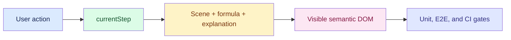

# Guided Lesson Step Animation Test Review

> **Resolution update (2026-08-31): CLOSED.** This report preserves the independent pre-fix test findings. CI now gates production dependency audit, lint, 117 unit/semantic tests, production build, per-domain bundle budgets and 35 Playwright tests. Browser coverage includes direct/back/next/reset/autoplay/speed controls, Enter/Space, focus, live region, data table, reduced motion, formula bindings, measured transfer endpoints, six grammars and every joint on all 156 routes at 320, 390 and 1440 px. See [the final review](guided-step-animation-final-review.md).

**Verdict: Changes requested.** The current tests pass, but they do not enforce several approved acceptance conditions, and the fresh production manifest fails both domain isolation and the 100 KB transitive gzip budget.

## Intent

Review the guided-lesson integration tests and Vite/CI gates against the approved design, with emphasis on observable frame semantics, reversible synchronized navigation, formula bindings, accessibility, viewport stability, and production-bundle enforcement. This is a test review only; no implementation changes were made.

## Findings

### P0 - The production bundle contract is neither gated nor currently satisfied

[vite.config.ts:22](/Users/bytedance/MyProject/algo-vis/vite.config.ts:22) emits a manifest, but [ci.yml:40](/Users/bytedance/MyProject/algo-vis/.github/workflows/ci.yml:40) only runs the ordinary build; no test reads the manifest. A fresh build followed by the specified recursive `imports` plus `dynamicImports` traversal found that every guided-domain wrapper reaches the other three wrappers. Each domain reaches the same 239 non-`vendor-*` project JS files totaling 1,136,932 gzip bytes (1,110.3 KiB), over eleven times the 100 KB limit. The manifest shows each wrapper importing `index.html`, which exposes the other lazy routes. CI can therefore remain green while both approved production constraints fail.

Required test: after `pnpm build`, locate the four resolved wrapper entries in `dist/.vite/manifest.json`, reject cross-domain reachability, deduplicate reachable project JS, gzip the actual files, and fail above 100 KB.

### P1 - The semantic contract accepts prose-only animation state

[guidedLessonScenes.contract.test.ts:86](/Users/bytedance/MyProject/algo-vis/tests/guidedLessonScenes.contract.test.ts:86) delegates validity to `validateLessonScene`, while [guidedLessonScenes.contract.test.ts:107](/Users/bytedance/MyProject/algo-vis/tests/guidedLessonScenes.contract.test.ts:107) only checks that adjacent signatures differ. A mutation probe replaced every AI 10072 entity value, datum, transfer payload, and expected debug value with that joint's flow label. Validation returned no errors, all 3 adjacent pairs still differed, and the lesson contained zero numeric values. Thus a regression can replace computation with changing prose and still pass the suite.

Required test: enforce at least one numeric state and one expected-value assertion per lesson, and reject state values or transfer payloads copied from flow labels.

### P1 - Reversible and automatic navigation are not exercised

The CUDA test at [lesson-scenes.spec.ts:135](/Users/bytedance/MyProject/algo-vis/tests/e2e/lesson-scenes.spec.ts:135) and the 156-route smoke test at [lesson-scenes.spec.ts:245](/Users/bytedance/MyProject/algo-vis/tests/e2e/lesson-scenes.spec.ts:245) change frames only by clicking timeline joints. No test invokes Previous, Next, Reset, Autoplay, Pause, or speed controls, and no client-side route change verifies reset behavior. Regressions in the shared playback path, focus retention during autoplay, or synchronization among frame, selected joint, phase explanation, and formula can pass.

Required test: run direct jump, backward, forward, reset, speed change, autoplay/pause, and route-change sequences while asserting `data-current-step`, `aria-pressed`, frame ID, explanation, formula, and focus after every action.

### P2 - Formula bindings are not checked in every formula-visible phase

The browser check at [lesson-scenes.spec.ts:198](/Users/bytedance/MyProject/algo-vis/tests/e2e/lesson-scenes.spec.ts:198) samples one CUDA 201 phase. The full contract at [guidedLessonScenes.contract.test.ts:86](/Users/bytedance/MyProject/algo-vis/tests/guidedLessonScenes.contract.test.ts:86) does not independently require each binding to remain visible in every intermediate frame. A mutation that hid the only `X`-bound entity in AI 10072 frame `matrix-qhf71` still produced no validation errors. Because the course formula remains rendered across phases, this permits a visible formula to lose its scene mapping mid-lesson.

Required test: for every formula-visible resolved frame, assert that each formula binding has at least one visible associated entity; add an E2E phase transition that verifies the displayed mapping updates with the frame.

### P2 - The accessibility and reduced-motion test asserts only a subset of its contract

[lesson-scenes.spec.ts:187](/Users/bytedance/MyProject/algo-vis/tests/e2e/lesson-scenes.spec.ts:187) emulates reduced motion and presses Enter, but it does not test Space, changing live-region text, the screen-reader input/operation/output table, autoplay focus retention, or computed movement/scale transition duration of zero. Its final state assertion proves that one keyboard action works, not that reduced motion is honored.

Required test: cover Enter and Space, inspect live-region and table contents after frame changes, retain an explicitly focused control during autoplay, and assert zero computed transform/position transition duration under `prefers-reduced-motion: reduce` while values still change.

### P2 - Viewport and transition-performance coverage is incomplete

The representative routes are hard-coded at [lesson-scenes.spec.ts:7](/Users/bytedance/MyProject/algo-vis/tests/e2e/lesson-scenes.spec.ts:7), rather than selecting registry maxima for entities, connections, and flow count. The six-grammar stability loop at [lesson-scenes.spec.ts:263](/Users/bytedance/MyProject/algo-vis/tests/e2e/lesson-scenes.spec.ts:263) omits 390x844, and [lesson-scenes.spec.ts:72](/Users/bytedance/MyProject/algo-vis/tests/e2e/lesson-scenes.spec.ts:72) only checks the settled one-frame state, never the in-transition limit of two roots. Current registry inspection identifies CUDA 202 as the maximum-flow scene, but it is absent from the representative set.

Required test: derive dense cases from scene data, run the stability assertions at all three approved viewports, and sample frame-root count during transition (`<= 2`) as well as after settlement (`=== 1`).

### P2 - The required five-way ID equality is split across weaker, circular oracles

The domain contract at [guidedLessonScenes.contract.test.ts:33](/Users/bytedance/MyProject/algo-vis/tests/guidedLessonScenes.contract.test.ts:33) compares manifest, blueprints, and scene getters. The E2E route list at [lesson-scenes.spec.ts:26](/Users/bytedance/MyProject/algo-vis/tests/e2e/lesson-scenes.spec.ts:26) is generated from those same blueprints. No pure test independently derives and compares runtime data, manifest, blueprint, scene, and routed-visualizer sets in both directions, so extra or misregistered entries can evade the intended equality check.

Required test: independently derive all five sets per domain and assert exact set equality, including absence of extras.

## Verification Evidence

- `pnpm test`: passed, 30/30 tests.
- `pnpm exec tsc --noEmit`: passed.
- Targeted ESLint for the reviewed test and config files: passed with zero warnings.
- `pnpm exec playwright test tests/e2e/lesson-scenes.spec.ts --list`: passed discovery, 10 tests.
- Focused Playwright execution could not start Vite in this sandbox: `listen EPERM 127.0.0.1:5173`. This is an environment limitation, so browser behavior was not reported as passing.
- Fresh Vite production build to `/tmp/algo-vis-step-animation-review-20260828-final`: passed; manifest traversal then failed isolation and size as described in P0.
- Mutation probes: prose-only state and hidden intermediate formula binding both passed current validation, confirming P1 and P2 false-negative paths.
- Static review confirmed strict KaTeX checks for course and operation formulas, exact CUDA 201 barrier/transfers/result checks, debug assertion evaluation, the settled single-frame check, representative DOM/collision limits, and 156-route smoke coverage.

## Residual Risks

The screenshot attachments were not visually reviewed because the browser server could not bind in this environment. No dependency-audit result is recorded by the reviewed CI change, despite the approved quality gate requesting one.
