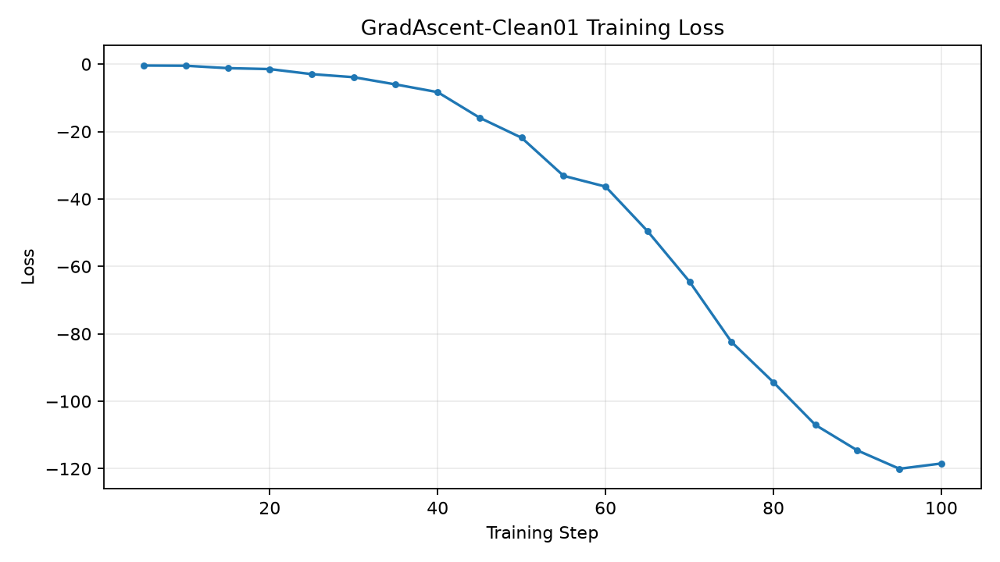
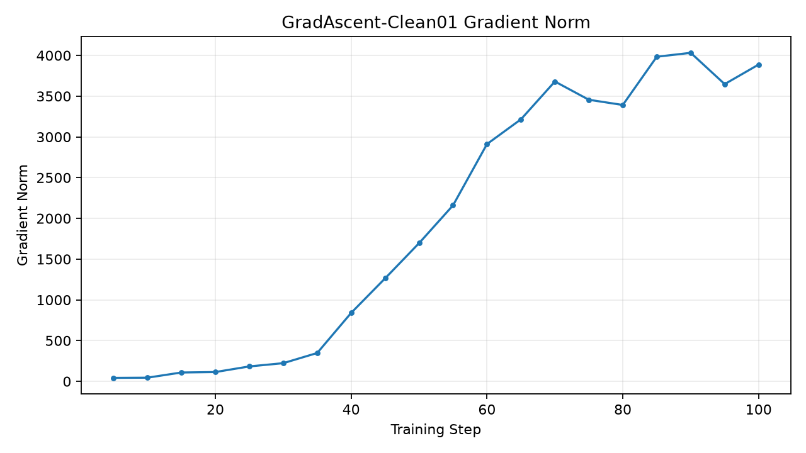
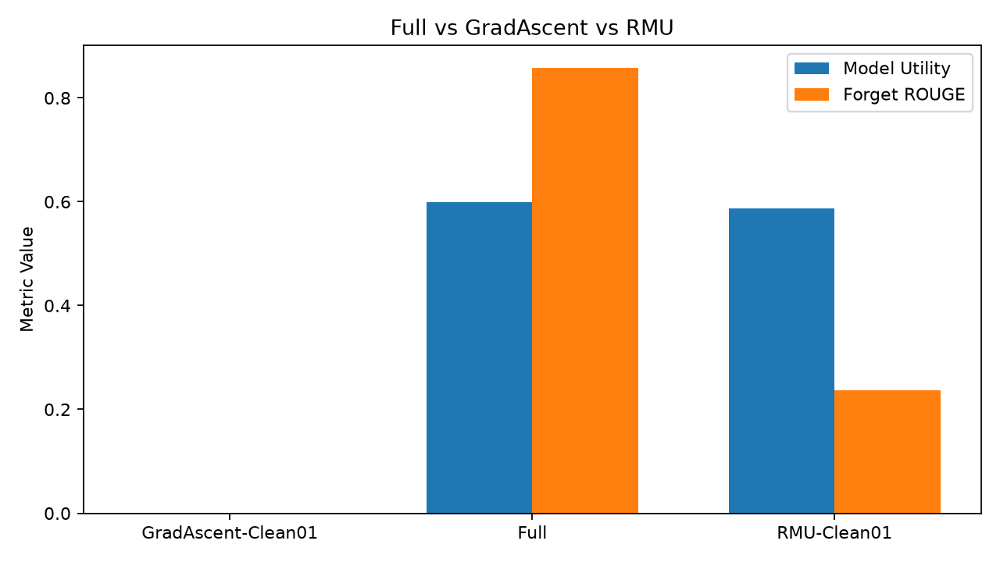

# 实验一：GradAscent-Clean01 中文实验报告

## 一、实验基本信息

- 实验名称：GradAscent-Clean01
- 实验任务：TOFU Forget01 机器遗忘
- 实验算法：Gradient Ascent
- 原始模型：经过 SHA-256 校验的官方 TOFU Full
- Forget 数据集：forget01
- Retain 数据集：retain99
- Holdout 数据集：holdout01
- 训练步数：100
- 实际完成 Epoch：10.0
- 实验状态：训练及标准 TOFU 评估已完成
- 归档时间：2026-10-10 20:55:44

## 二、实验目的

使用经过完整性校验的官方 Full 模型纠正历史 GradAscent 实验，
排除异常模型权重造成的干扰，并与官方 Full、RMU-Clean01
在一致的 TOFU 评估协议下比较遗忘效果及非目标能力损伤。

## 三、训练设置

沿用历史 GradAscent 实验的主要参数：

- 训练轮数：10 epochs
- 学习率：1e-5
- Batch Size：1
- 梯度累积：4
- BF16：开启
- Gradient Checkpointing：开启
- 优化器：paged_adamw_32bit

完整参数以本目录 `train_config.yaml` 为准。

## 四、评估协议

- Forget：forget01
- Holdout：holdout01
- 参考模型评估日志：Retain99
- Batch Size：1
- 模型精度：BF16
- Attention：SDPA

完整配置见 `eval_config.yaml`。

## 五、GradAscent 官方评估结果

| 指标 | 数值 |
|---|---:|
| forget_Q_A_Prob | 4.355751e-11 |
| forget_Q_A_ROUGE | 0 |
| forget_quality | 1.4882723e-21 |
| forget_truth_ratio | 0.028309791 |
| model_utility | 0 |
| extraction_strength | 0.029059408 |
| privleak | 58.145065 |

## 六、与其他已完成实验比较

| 指标 | GradAscent-Clean01 | Full | RMU-Clean01 |
|---|---:|---:|---:|
| forget_Q_A_ROUGE | 0 | 0.85821234 | 0.2369882 |
| forget_Q_A_Prob | 4.355751e-11 | 0.90185547 | 0.031909037 |
| model_utility | 0 | 0.59902294 | 0.5868513 |
| forget_quality | 1.4882723e-21 | 0.0067607323 | 0.1649727 |
| extraction_strength | 0.029059408 | 0.72396855 | 0.029059408 |

注：此表比较实际 TOFU 评估输出；Forget ROUGE 降低不能单独
证明高质量遗忘。不同算法仍需同时检查非目标任务能力。

## 七、实验现象与分析

1. GradAscent-Clean01 的 Forget ROUGE 为 0，
   Forget QA Probability 为 4.355751e-11，
   表明目标答案在标准评估下的匹配度和概率显著降低。
2. Model Utility 为 0，
   说明当前训练配置造成了严重的整体模型效用退化，
   不能将其视为成功的选择性遗忘。
3. Forget Quality 为 1.4882723e-21，
   该数值属于 KS 检验 p 值，不是遗忘成功率。
4. privleak 为 58.145065，
   是评估框架定义的参考指标，不能直接解释为隐私泄露百分比。
5. 训练日志中的负 Loss 和较大梯度范数提示更新强度很高。
   尚需结合逐样本生成结果判断具体退化机制。
6. 本次实验采用校验后的 Full 权重，
   与历史异常缓存实验应严格区分。

## 八、图表

## 九、复现与原始记录

训练结果：
`/home/research/open-unlearning/saves/unlearn/tofu_Llama-3.2-1B-Instruct_forget01_GradAscent_Clean01`

评估结果：
`/home/research/open-unlearning/saves/eval/tofu_Llama-3.2-1B-Instruct_forget01_GradAscent_Clean01_eval`

- `TOFU_SUMMARY.json`：官方汇总指标副本
- `trainer_state.json`：原始训练状态副本
- `train_config.yaml`：实际训练配置副本
- `eval_config.yaml`：实际评估配置副本
- `MANIFEST.sha256`：归档来源文件哈希清单

本归档不包含大型模型权重，不改变训练和评估原始文件。
