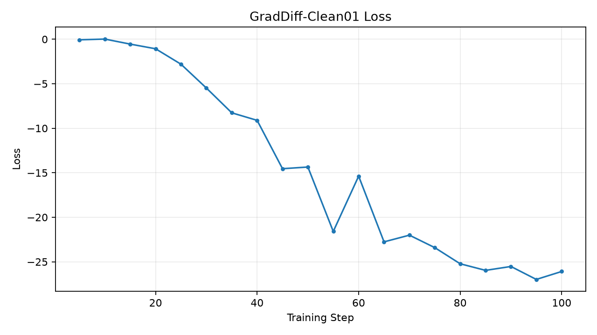
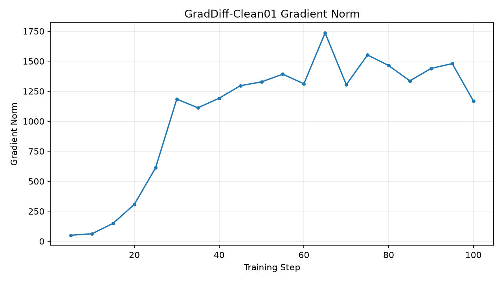
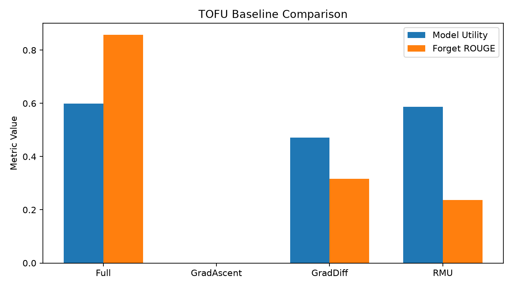

# 实验二：GradDiff-Clean01 中文实验报告

## 一、实验基本信息

- 算法：GradDiff（Gradient Difference）
- 数据集：TOFU
- Forget：forget01
- Retain：retain99
- Holdout：holdout01
- 初始模型：SHA-256 已校验的官方 TOFU Full
- 训练步数：100
- 完成轮数：10.0
- 训练状态：完成
- 评估状态：完成
- 归档时间：2026-10-10 21:40:17

## 二、实验目的

纠正历史 GradDiff 实验可能受到的异常模型权重影响，
使用经过完整性校验的 Full 模型重新训练，
衡量目标知识遗忘与非目标知识保留之间的权衡。

## 三、训练配置

- Epochs：10
- Learning Rate：1e-5
- Batch Size：1
- Gradient Accumulation：4
- BF16：开启
- Gradient Checkpointing：开启
- Optimizer：paged_adamw_32bit
- Gamma：1.0
- Alpha：1.0
- Retain Loss Type：NLL

完整配置见 `train_config.yaml`。

## 四、统一评估协议

- Forget：forget01
- Holdout：holdout01
- Retain99：参考评估日志
- Batch Size：1
- BF16 + SDPA

完整配置见 `eval_config.yaml`。

## 五、GradDiff-Clean01 真实评估指标

| 指标 | 数值 |
|---|---:|
| extraction_strength | 0.048344262 |
| forget_Q_A_Prob | 0.0085499853 |
| forget_Q_A_ROUGE | 0.31618777 |
| forget_quality | 0.40458741 |
| forget_truth_ratio | 0.5569833 |
| model_utility | 0.47151575 |
| privleak | 66.825208 |

## 六、与其他模型比较

| 指标 | Full | GradAscent | GradDiff | RMU |
|---|---:|---:|---:|---:|
| forget_Q_A_ROUGE | 0.85821234 | 0 | 0.31618777 | 0.2369882 |
| forget_Q_A_Prob | 0.90185547 | 4.355751e-11 | 0.0085499853 | 0.031909037 |
| model_utility | 0.59902294 | 0 | 0.47151575 | 0.5868513 |
| forget_quality | 0.0067607323 | 1.4882723e-21 | 0.40458741 | 0.1649727 |
| extraction_strength | 0.72396855 | 0.029059408 | 0.048344262 | 0.029059408 |

## 七、实验结果分析

1. Forget ROUGE 为 0.31618777，
   表明目标答案文本匹配度显著低于原始 Full。
2. Forget QA Probability 为 0.0085499853，
   表明标准问题下目标答案概率明显降低。
3. Model Utility 为 0.47151575，
   相比官方 Full 存在明显下降，但未像 GradAscent 一样归零。
4. Forget Quality 为 0.40458741。
   这是 KS 检验 p 值，不能解释为遗忘成功率。
5. Privleak 为 66.825208，
   不能直接解释为隐私泄露百分比。
6. 遗忘指标降低并不等于模型已不可恢复，
   后续仍需要恢复攻击和逐样本评估。

## 八、实验图片

## 九、原始文件与复现记录

训练目录：
`/home/research/open-unlearning/saves/unlearn/tofu_Llama-3.2-1B-Instruct_forget01_GradDiff_Clean01`

评估目录：
`/home/research/open-unlearning/saves/eval/tofu_Llama-3.2-1B-Instruct_forget01_GradDiff_Clean01_eval`

本归档包含训练配置、评估配置、原始训练状态和评估汇总指标副本。
完整逐样本评估保留在原始 `TOFU_EVAL.json` 中。

归档不复制大型模型权重，不修改旧实验及封存的 Exp009。
